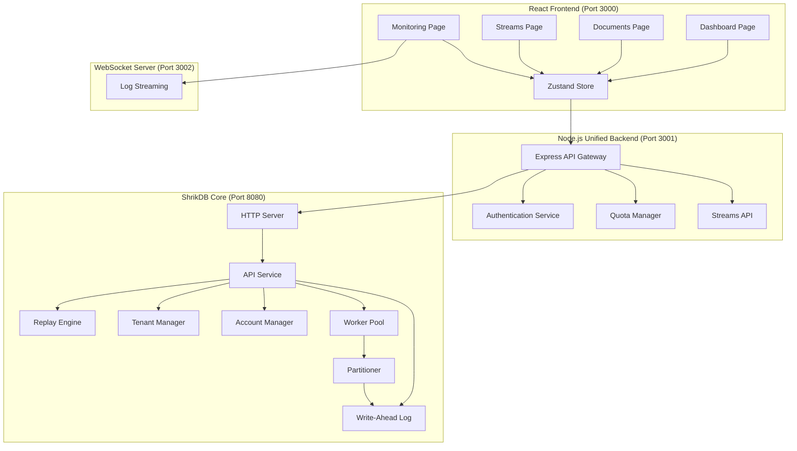

# Design Document: Full Stack Integration

## Overview

This design document describes the architecture and implementation approach for achieving complete end-to-end integration of the ShrikDB system. The system consists of three main layers: a React frontend dashboard, a Node.js unified backend API, and a Go-based event-sourced database engine. The design ensures all data flows through the event log with no mock data, strict tenant isolation, production-level performance, and comprehensive observability.

## Architecture



## Components and Interfaces

### 1. Frontend Layer (React + TypeScript)

#### Store Interface (Zustand)
```typescript
interface AppState {
  // Authentication
  isAuthenticated: boolean;
  currentProject: string | null;
  clientID: string | null;
  
  // Dynamic Data (from event log)
  documents: Document[];
  streams: string[];
  streamMessages: StreamMessage[];
  auditLogs: AuditLog[];
  
  // Real-time Metrics
  metrics: {
    totalDocuments: number;
    activeStreams: number;
    eventsPerSecond: number;
    storageUsedBytes: number;
  };
  
  // Actions
  loadStateFromEvents(): Promise<void>;
  addDocument(collection: string, content: any): Promise<void>;
  publishMessage(stream: string, payload: any): Promise<void>;
  fetchMetrics(): Promise<void>;
}
```

#### API Client Interface
```typescript
interface ShrikDBClient {
  // Authentication
  authenticate(clientId: string, clientKey: string): Promise<AuthResponse>;
  
  // Documents
  createDocument(collection: string, content: any): Promise<DocumentResponse>;
  queryDocuments(collection?: string, fromSequence?: number): Promise<DocumentResponse>;
  
  // Streams
  publishMessage(stream: string, payload: any): Promise<StreamResponse>;
  consumeMessages(stream: string, consumerGroup: string): Promise<StreamResponse>;
  
  // Metrics
  getMetrics(): Promise<MetricsResponse>;
  getSystemStats(): Promise<SystemStatsResponse>;
}
```

### 2. Backend Layer (Node.js + Express)

#### Unified Backend API Routes
```
POST   /api/auth/login          - Authenticate with credentials
POST   /api/auth/logout         - End session

POST   /api/documents           - Create document (→ ShrikDB)
GET    /api/documents           - Query documents (→ ShrikDB)
PUT    /api/documents/:id       - Update document (→ ShrikDB)
DELETE /api/documents/:id       - Delete document (→ ShrikDB)

POST   /api/streams/publish     - Publish message (→ Phase 2AB)
GET    /api/streams/consume     - Consume messages (→ Phase 2AB)
POST   /api/streams/subscribe   - Subscribe to stream (→ Phase 2AB)

GET    /api/metrics             - Get system metrics (→ ShrikDB)
GET    /api/metrics/realtime    - Get real-time throughput
GET    /api/health/integrated   - Check all service health

POST   /api/accounts            - Create account (→ ShrikDB)
GET    /api/accounts            - List accounts (→ ShrikDB)
POST   /api/projects            - Create project (→ ShrikDB)

GET    /api/workers             - Get worker status (→ ShrikDB)
GET    /api/workers/metrics     - Get worker metrics (→ ShrikDB)
GET    /api/partitions          - Get partition info (→ ShrikDB)
```

#### Authentication Service
```javascript
class AuthenticationService {
  // Validate credentials against ShrikDB
  async validateCredentials(clientId, clientKey): Promise<AuthContext>;
  
  // Create session with token
  async createSession(clientId, clientKey): Promise<SessionData>;
  
  // Middleware for request authentication
  createAuthMiddleware(): ExpressMiddleware;
}
```

#### Quota Manager
```javascript
class QuotaManager {
  // Check rate limit before allowing request
  checkRateLimit(tenantId, namespaceId): RateLimitResult;
  
  // Record event for metrics
  recordEvent(tenantId, namespaceId, eventType, latency): void;
  
  // Get namespace statistics
  getNamespaceStats(tenantId, namespaceId): NamespaceStats;
  
  // Apply backpressure when needed
  applyBackpressure(tenantId): BackpressureResult;
}
```

### 3. Database Layer (Go)

#### API Service Interface
```go
type Service interface {
    // Event Operations
    AppendEvent(ctx context.Context, req *AppendEventRequest) (*AppendEventResponse, error)
    ReadEvents(ctx context.Context, req *ReadEventsRequest) (*ReadEventsResponse, error)
    Replay(ctx context.Context, req *ReplayRequest) (*ReplayResponse, error)
    
    // Account Management
    CreateAccount(ctx context.Context, req *CreateAccountRequest) (*CreateAccountResponse, error)
    CreateAccountProject(ctx context.Context, req *CreateAccountProjectRequest) (*CreateAccountProjectResponse, error)
    ListAccounts(ctx context.Context, req *ListAccountsRequest) (*ListAccountsResponse, error)
    
    // Tenant Management
    CreateTenant(ctx context.Context, req *CreateTenantRequest) (*CreateTenantResponse, error)
    ListTenants(ctx context.Context, req *ListTenantsRequest) (*ListTenantsResponse, error)
    
    // Health & Metrics
    HealthCheck() *HealthStatus
    GetMetrics() *Metrics
    GetWALMetrics() *WALMetrics
}
```

#### Worker Manager Interface
```go
type WorkerManager interface {
    // Worker lifecycle
    StartWorkers(count int) error
    StopWorkers() error
    
    // Partition management
    GetPartitionInfo() *PartitionInfo
    RebalancePartitions() error
    
    // Metrics
    GetWorkerList() []WorkerInfo
    GetSystemMetrics() *SystemMetrics
}
```

## Data Models

### Event Structure
```go
type Event struct {
    EventID              string            `json:"event_id"`
    ProjectID            string            `json:"project_id"`
    TenantID             string            `json:"tenant_id"`
    Namespace            string            `json:"namespace"`
    EventType            string            `json:"event_type"`
    Payload              json.RawMessage   `json:"payload"`
    PayloadHash          string            `json:"payload_hash"`
    SequenceNumber       uint64            `json:"sequence_number"`
    TenantSequenceNumber uint64            `json:"tenant_sequence_number"`
    Timestamp            time.Time         `json:"timestamp"`
    PreviousHash         string            `json:"previous_hash"`
    CorrelationID        string            `json:"correlation_id"`
    ClientID             string            `json:"client_id"`
}
```

### Account Structure
```go
type AccountState struct {
    AccountID    string              `json:"account_id"`
    Name         string              `json:"name"`
    Status       AccountStatus       `json:"status"`
    Projects     []ProjectInfo       `json:"projects"`
    Users        []UserInfo          `json:"users"`
    Quotas       map[string]int64    `json:"quotas"`
    Usage        map[string]int64    `json:"current_usage"`
    CreatedAt    time.Time           `json:"created_at"`
    LastActivity time.Time           `json:"last_activity"`
}
```

### Metrics Structure
```typescript
interface SystemMetrics {
    // Throughput
    eventsPerSecond: number;
    bytesPerSecond: number;
    
    // Latency
    appendLatencyP50: number;
    appendLatencyP99: number;
    readLatencyP50: number;
    readLatencyP99: number;
    
    // Workers
    activeWorkers: number;
    totalPartitions: number;
    eventsProcessed: number;
    
    // Storage
    walSizeBytes: number;
    eventsTotal: number;
    
    // Quotas
    rateLimitHits: number;
    backpressureEvents: number;
}
```

</content>
</invoke>


## Correctness Properties

*A property is a characteristic or behavior that should hold true across all valid executions of a system—essentially, a formal statement about what the system should do. Properties serve as the bridge between human-readable specifications and machine-verifiable correctness guarantees.*

### Property 1: Data Isolation Between Tenants

*For any* two distinct tenants T1 and T2, and any query Q executed by T1, the result set SHALL contain only events where tenant_id equals T1, and SHALL NOT contain any events belonging to T2.

**Validates: Requirements 1.3, 1.4, 12.1, 12.3**

### Property 2: Document Event Sourcing Round-Trip

*For any* valid document D with collection C and content X, creating D then querying documents in collection C SHALL return a document with content equivalent to X, and the event log SHALL contain a document.created event with the same content.

**Validates: Requirements 2.1, 2.2, 2.3, 2.4**

### Property 3: Document Recovery After Restart

*For any* set of documents created before a system restart, replaying the event log SHALL reconstruct the exact same document state, with all documents recoverable and no data loss.

**Validates: Requirements 2.6, 6.1, 6.6**

### Property 4: Stream Message Ordering

*For any* stream S and sequence of messages M1, M2, ..., Mn published in order, a consumer subscribing to S SHALL receive messages in the same order (M1 before M2 before ... before Mn).

**Validates: Requirements 3.1, 3.2**

### Property 5: Consumer Group Message Distribution

*For any* stream S with messages M and consumer group G with members C1, C2, ..., Cn, each message in M SHALL be delivered to exactly one consumer in G (no duplicates, no losses).

**Validates: Requirements 3.3**

### Property 6: Stream Offset Round-Trip

*For any* consumer group G consuming stream S, if offset O is committed and the system restarts, consumption SHALL resume from offset O (not from the beginning or a different offset).

**Validates: Requirements 3.4, 3.6**

### Property 7: Worker Partition Assignment Consistency

*For any* set of workers W and partitions P, the partition assignment SHALL follow consistent hashing such that adding or removing a worker only reassigns partitions from/to that worker, minimizing data movement.

**Validates: Requirements 4.1, 4.3, 4.4**

### Property 8: Exactly-Once Processing Within Partition

*For any* partition P and event E assigned to P, E SHALL be processed exactly once regardless of worker failures or restarts (no duplicates, no losses).

**Validates: Requirements 4.2, 4.6**

### Property 9: Rate Limit Enforcement

*For any* tenant T with rate limit L requests/second, if T sends more than L requests in one second, the System SHALL return HTTP 429 for requests exceeding L.

**Validates: Requirements 5.1, 5.3**

### Property 10: Backpressure Data Integrity

*For any* sequence of events E1, E2, ..., En sent during backpressure conditions, all events SHALL eventually be persisted in order with no data loss or corruption.

**Validates: Requirements 5.2, 5.6**

### Property 11: Credential Validation Against Event Log

*For any* credentials (clientId, clientKey) used for authentication, validation SHALL query the event log to verify the credentials exist and are valid (not use hardcoded or mock data).

**Validates: Requirements 1.6, 12.2**

### Property 12: Dynamic Dashboard Metrics

*For any* metric M displayed on the Dashboard (Total Documents, Active Streams, Events/Sec, Storage Used), M SHALL equal the value computed from querying the backend API, which in turn queries the event log.

**Validates: Requirements 8.2, 11.1, 11.2, 11.3, 11.4, 11.5, 11.6**

### Property 13: Cross-Tenant Access Rejection

*For any* tenant T1 attempting to access resources belonging to tenant T2 (where T1 ≠ T2), the System SHALL return HTTP 403 Forbidden and log a security event.

**Validates: Requirements 12.3, 12.6**

### Property 14: Metrics Emission on Event Processing

*For any* event E processed by the system, the System SHALL emit metrics including throughput (events/sec), latency (processing time), and error count (if applicable).

**Validates: Requirements 7.2, 7.4**

### Property 15: Service Retry with Exponential Backoff

*For any* service connection failure, the System SHALL retry with exponential backoff (delay doubles each attempt) up to a maximum retry count, and SHALL NOT return HTTP 500 errors to clients.

**Validates: Requirements 10.4, 10.6**

## Error Handling

### Frontend Error Handling

1. **Connection Errors**: Display user-friendly error message with retry button
2. **Authentication Errors**: Redirect to login with clear error message
3. **API Errors**: Show error toast with correlation ID for debugging
4. **WebSocket Disconnection**: Auto-reconnect with exponential backoff

### Backend Error Handling

1. **ShrikDB Unavailable**: Return 503 with retry-after header
2. **Authentication Failed**: Return 401 with clear error code
3. **Rate Limit Exceeded**: Return 429 with rate limit headers
4. **Invalid Request**: Return 400 with validation errors
5. **Internal Error**: Return 500 with correlation ID (never expose stack traces)

### Database Error Handling

1. **WAL Write Failure**: Retry with fsync, fail request if persistent
2. **Replay Failure**: Log error, mark project as degraded
3. **Tenant Violation**: Log security event, return error
4. **Quota Exceeded**: Return error with quota details

## Testing Strategy

### Unit Tests

Unit tests verify specific examples and edge cases:

1. **Authentication Service**: Test credential validation, session creation, token refresh
2. **Quota Manager**: Test rate limiting, quota enforcement, backpressure
3. **API Client**: Test request formatting, response parsing, error handling
4. **Store**: Test state management, event projection, optimistic updates

### Property-Based Tests

Property-based tests verify universal properties across all inputs using fast-check (TypeScript) and testing/quick (Go):

1. **Data Isolation**: Generate random tenants and verify isolation
2. **Event Sourcing**: Generate random documents and verify round-trip
3. **Stream Ordering**: Generate random messages and verify order preservation
4. **Worker Assignment**: Generate random worker sets and verify consistent hashing
5. **Rate Limiting**: Generate random request patterns and verify enforcement

### Integration Tests

Integration tests verify end-to-end flows:

1. **Frontend → Backend → Database**: Full CRUD operations
2. **Stream Publish → Consume**: Message delivery verification
3. **Service Recovery**: Kill and restart services, verify state
4. **Multi-tenant Operations**: Concurrent tenant operations with isolation

### Performance Tests

Performance tests verify production benchmarks:

1. **Throughput**: Measure events/second under load
2. **Latency**: Measure P50, P95, P99 latencies
3. **Scalability**: Measure performance with increasing workers
4. **Backpressure**: Measure behavior under overload

### Test Configuration

- Property tests: Minimum 100 iterations per property
- Integration tests: Run against real services (no mocks)
- Performance tests: Run for minimum 60 seconds per benchmark
- All tests tagged with feature and property references
