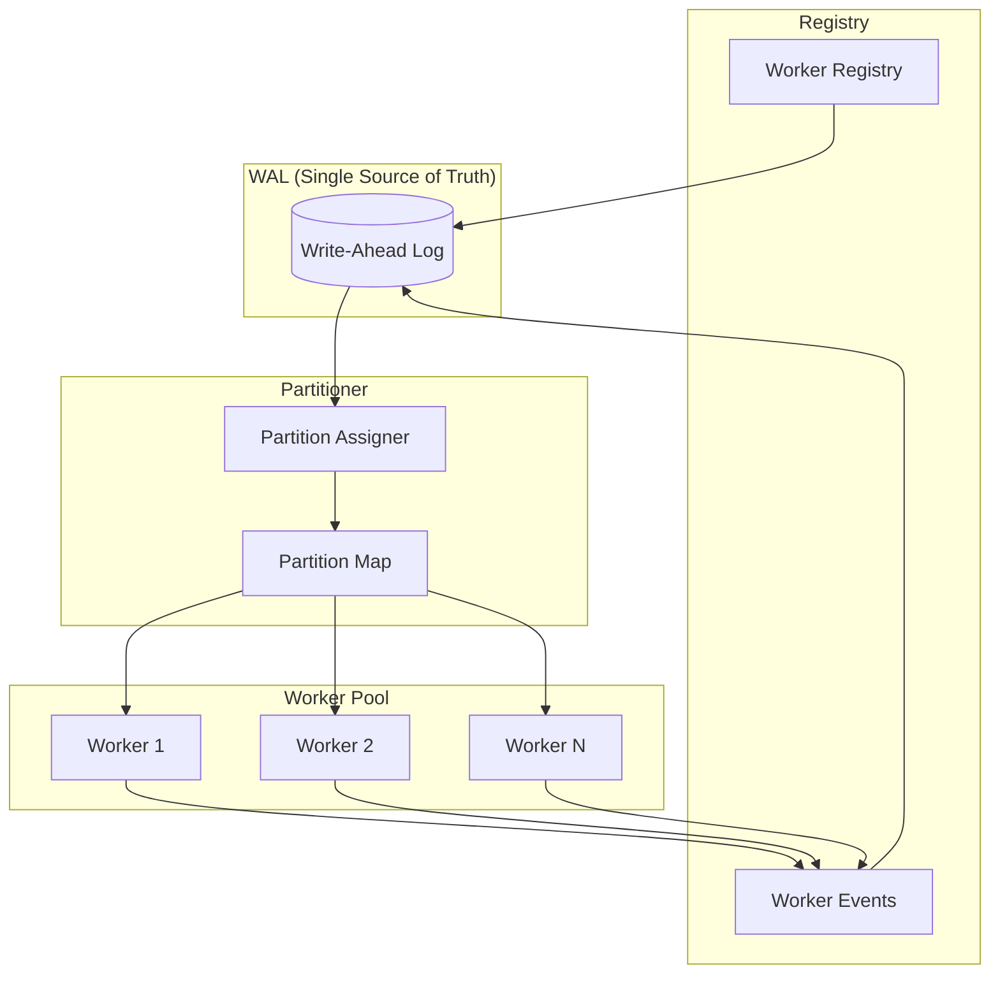

# Design Document: Horizontal Scaling for ShrikDB

## Overview

This design document describes the implementation of true horizontal scaling for ShrikDB through a multi-worker execution model. The system enables deterministic partitioning of work across multiple workers while preserving all existing guarantees: event-sourcing, replay safety, and WAL as the single source of truth.

The design follows these foundational principles:
- **Workers own responsibility, not data** - All state is derived from events
- **WAL is the only source of truth** - No hidden global registries
- **All state is event-sourced, replayable, and deterministic**
- **No wall-clock-based logic** - Use sequence numbers and logical timestamps
- **No optimistic assumptions about ordering**

## Architecture



### High-Level Flow

1. **Worker Registration**: Workers register by appending WORKER_REGISTERED events to WAL
2. **Partition Assignment**: Partitioner reads WAL to determine active workers and assigns partitions
3. **Event Processing**: Each worker consumes events from WAL for its assigned partitions
4. **Checkpoint**: Workers record processing progress via checkpoint events
5. **Recovery**: On restart, workers replay WAL to restore state and resume processing

## Components and Interfaces

### 1. Worker Package (`shrikdb/pkg/worker`)

```go
// Worker represents a processing unit in the horizontal scaling model.
type Worker struct {
    ID              string
    Config          WorkerConfig
    Registry        *Registry
    Partitioner     *Partitioner
    Processor       *EventProcessor
    CheckpointStore *CheckpointStore
    Logger          zerolog.Logger
    
    mu              sync.RWMutex
    state           WorkerState
    assignedParts   []int
    stopCh          chan struct{}
}

// WorkerConfig holds worker configuration.
type WorkerConfig struct {
    WorkerID        string        // Unique worker identifier
    WALPath         string        // Path to WAL directory
    PartitionCount  int           // Total number of partitions
    PartitionKey    PartitionKey  // Key used for partitioning
    ProcessInterval time.Duration // Interval between processing cycles
}

// WorkerState represents the current state of a worker.
type WorkerState int

const (
    WorkerStateInitializing WorkerState = iota
    WorkerStateActive
    WorkerStateInactive
    WorkerStateShutdown
)

// Start initializes and starts the worker.
func (w *Worker) Start(ctx context.Context) error

// Stop gracefully shuts down the worker.
func (w *Worker) Stop(ctx context.Context) error

// GetAssignedPartitions returns the partitions assigned to this worker.
func (w *Worker) GetAssignedPartitions() []int

// GetState returns the current worker state.
func (w *Worker) GetState() WorkerState
```

### 2. Worker Registry (`shrikdb/pkg/worker/registry.go`)

```go
// Registry manages worker lifecycle through WAL events.
type Registry struct {
    wal     *wal.WAL
    logger  zerolog.Logger
    
    mu      sync.RWMutex
    workers map[string]*WorkerInfo
}

// WorkerInfo contains information about a registered worker.
type WorkerInfo struct {
    WorkerID      string
    State         WorkerState
    RegisteredAt  uint64  // WAL sequence number
    LastActiveSeq uint64  // Last activity sequence
    Config        WorkerConfig
}

// WorkerEvent types for WAL recording.
const (
    EventTypeWorkerRegistered   = "worker.registered"
    EventTypeWorkerShutdown     = "worker.shutdown"
    EventTypeWorkerInactive     = "worker.inactive"
    EventTypeWorkerReactivated  = "worker.reactivated"
)

// RegisterWorker records a worker registration in the WAL.
func (r *Registry) RegisterWorker(ctx context.Context, config WorkerConfig) (*WorkerInfo, error)

// ShutdownWorker records a graceful worker shutdown in the WAL.
func (r *Registry) ShutdownWorker(ctx context.Context, workerID string) error

// MarkInactive records a worker as inactive (failed heartbeat).
func (r *Registry) MarkInactive(ctx context.Context, workerID string) error

// Reactivate records a worker reactivation.
func (r *Registry) Reactivate(ctx context.Context, workerID string) error

// GetActiveWorkers returns all currently active workers.
func (r *Registry) GetActiveWorkers() []*WorkerInfo

// RebuildFromWAL rebuilds registry state by replaying WAL events.
func (r *Registry) RebuildFromWAL(ctx context.Context) error
```

### 3. Partitioner (`shrikdb/pkg/worker/partitioner.go`)

```go
// PartitionKey defines the key used for partitioning.
type PartitionKey int

const (
    PartitionKeyProjectID PartitionKey = iota
    PartitionKeyStreamID
    PartitionKeyEventHash
)

// Partitioner handles deterministic partition assignment.
type Partitioner struct {
    partitionCount int
    partitionKey   PartitionKey
    registry       *Registry
    logger         zerolog.Logger
    
    mu             sync.RWMutex
    assignments    map[int]string // partition -> workerID
}

// GetPartition returns the partition number for an event.
// This is a pure function - deterministic based only on event data.
func (p *Partitioner) GetPartition(evt *event.Event) int

// GetWorkerForPartition returns the worker assigned to a partition.
func (p *Partitioner) GetWorkerForPartition(partition int) string

// GetPartitionsForWorker returns all partitions assigned to a worker.
func (p *Partitioner) GetPartitionsForWorker(workerID string) []int

// Rebalance recalculates partition assignments based on active workers.
// This is deterministic - same workers always produce same assignments.
func (p *Partitioner) Rebalance() map[int]string

// ComputePartitionKey extracts the partition key from an event.
func (p *Partitioner) ComputePartitionKey(evt *event.Event) string
```

### 4. Event Processor (`shrikdb/pkg/worker/processor.go`)

```go
// EventProcessor handles event processing for assigned partitions.
type EventProcessor struct {
    wal             *wal.WAL
    partitioner     *Partitioner
    checkpointStore *CheckpointStore
    handler         EventHandler
    logger          zerolog.Logger
    
    mu              sync.RWMutex
    workerID        string
    processing      bool
    lastProcessed   map[int]uint64 // partition -> last processed sequence
}

// EventHandler is called for each event during processing.
type EventHandler func(ctx context.Context, evt *event.Event) error

// ProcessEvents processes events for assigned partitions.
func (p *EventProcessor) ProcessEvents(ctx context.Context, partitions []int) error

// ProcessPartition processes events for a single partition.
func (p *EventProcessor) ProcessPartition(ctx context.Context, partition int) error

// GetLastProcessedSequence returns the last processed sequence for a partition.
func (p *EventProcessor) GetLastProcessedSequence(partition int) uint64

// SetEventHandler sets the handler for processing events.
func (p *EventProcessor) SetEventHandler(handler EventHandler)
```

### 5. Checkpoint Store (`shrikdb/pkg/worker/checkpoint.go`)

```go
// CheckpointStore manages processing checkpoints via WAL events.
type CheckpointStore struct {
    wal    *wal.WAL
    logger zerolog.Logger
    
    mu          sync.RWMutex
    checkpoints map[string]map[int]uint64 // workerID -> partition -> sequence
}

// Checkpoint event type.
const EventTypeCheckpoint = "worker.checkpoint"

// CheckpointPayload represents checkpoint event data.
type CheckpointPayload struct {
    WorkerID   string         `json:"worker_id"`
    Partitions map[int]uint64 `json:"partitions"` // partition -> last processed sequence
}

// SaveCheckpoint records a processing checkpoint in the WAL.
func (c *CheckpointStore) SaveCheckpoint(ctx context.Context, workerID string, partitions map[int]uint64) error

// GetCheckpoint returns the last checkpoint for a worker.
func (c *CheckpointStore) GetCheckpoint(workerID string) map[int]uint64

// RebuildFromWAL rebuilds checkpoint state by replaying WAL events.
func (c *CheckpointStore) RebuildFromWAL(ctx context.Context) error
```

### 6. Metrics Collector (`shrikdb/pkg/worker/metrics.go`)

```go
// MetricsCollector provides observability for the worker system.
type MetricsCollector struct {
    registry    *Registry
    partitioner *Partitioner
    processors  map[string]*EventProcessor
    wal         *wal.WAL
    logger      zerolog.Logger
}

// WorkerMetrics contains metrics for a single worker.
type WorkerMetrics struct {
    WorkerID          string         `json:"worker_id"`
    State             string         `json:"state"`
    AssignedPartitions []int         `json:"assigned_partitions"`
    EventsProcessed   uint64         `json:"events_processed"`
    LastProcessedSeq  uint64         `json:"last_processed_seq"`
}

// PartitionMetrics contains metrics for a single partition.
type PartitionMetrics struct {
    Partition        int    `json:"partition"`
    AssignedWorker   string `json:"assigned_worker"`
    LatestSequence   uint64 `json:"latest_sequence"`
    ProcessedSequence uint64 `json:"processed_sequence"`
    Lag              uint64 `json:"lag"`
}

// SystemMetrics contains overall system metrics.
type SystemMetrics struct {
    ActiveWorkers     int                `json:"active_workers"`
    TotalPartitions   int                `json:"total_partitions"`
    Workers           []WorkerMetrics    `json:"workers"`
    Partitions        []PartitionMetrics `json:"partitions"`
    TotalEventsProcessed uint64          `json:"total_events_processed"`
}

// GetSystemMetrics returns current system metrics derived from WAL state.
func (m *MetricsCollector) GetSystemMetrics() *SystemMetrics

// GetWorkerMetrics returns metrics for a specific worker.
func (m *MetricsCollector) GetWorkerMetrics(workerID string) *WorkerMetrics

// GetPartitionMetrics returns metrics for a specific partition.
func (m *MetricsCollector) GetPartitionMetrics(partition int) *PartitionMetrics
```

## Data Models

### Worker Events

```go
// WorkerRegisteredPayload is the payload for worker.registered events.
type WorkerRegisteredPayload struct {
    WorkerID       string       `json:"worker_id"`
    PartitionCount int          `json:"partition_count"`
    PartitionKey   string       `json:"partition_key"`
    Config         WorkerConfig `json:"config"`
}

// WorkerShutdownPayload is the payload for worker.shutdown events.
type WorkerShutdownPayload struct {
    WorkerID string `json:"worker_id"`
    Reason   string `json:"reason,omitempty"`
}

// WorkerInactivePayload is the payload for worker.inactive events.
type WorkerInactivePayload struct {
    WorkerID       string `json:"worker_id"`
    LastActiveSeq  uint64 `json:"last_active_seq"`
    DetectedBySeq  uint64 `json:"detected_by_seq"`
}

// WorkerReactivatedPayload is the payload for worker.reactivated events.
type WorkerReactivatedPayload struct {
    WorkerID      string `json:"worker_id"`
    PreviousState string `json:"previous_state"`
}
```

### Partition Assignment Algorithm

The partition assignment uses consistent hashing to ensure:
1. Deterministic assignment (same inputs → same outputs)
2. Minimal reassignment when workers change
3. Even distribution across workers

```go
// assignPartitions deterministically assigns partitions to workers.
func assignPartitions(partitionCount int, workers []string) map[int]string {
    if len(workers) == 0 {
        return nil
    }
    
    // Sort workers for deterministic ordering
    sort.Strings(workers)
    
    assignments := make(map[int]string)
    for partition := 0; partition < partitionCount; partition++ {
        // Simple modulo assignment for determinism
        workerIndex := partition % len(workers)
        assignments[partition] = workers[workerIndex]
    }
    
    return assignments
}

// getPartitionForEvent computes partition from event data.
func getPartitionForEvent(evt *event.Event, partitionCount int, key PartitionKey) int {
    var keyValue string
    
    switch key {
    case PartitionKeyProjectID:
        keyValue = evt.ProjectID
    case PartitionKeyStreamID:
        keyValue = evt.Namespace // Use namespace as stream ID
    case PartitionKeyEventHash:
        keyValue = evt.PayloadHash
    }
    
    // FNV-1a hash for deterministic distribution
    h := fnv.New32a()
    h.Write([]byte(keyValue))
    return int(h.Sum32() % uint32(partitionCount))
}
```

## Correctness Properties

*A property is a characteristic or behavior that should hold true across all valid executions of a system—essentially, a formal statement about what the system should do. Properties serve as the bridge between human-readable specifications and machine-verifiable correctness guarantees.*

### Property 1: Worker ID Determinism

*For any* worker configuration, computing the worker ID multiple times SHALL always produce the same result.

**Validates: Requirements 1.1**

### Property 2: Worker Event Recording

*For any* worker registration or shutdown, the WAL SHALL contain a corresponding event with all required fields (worker_id, timestamp, and configuration for registration; worker_id and timestamp for shutdown).

**Validates: Requirements 1.2, 1.3**

### Property 3: Worker Registry Round-Trip

*For any* worker registry state, clearing the registry and replaying all WAL events SHALL produce an equivalent registry state with the same active workers and their configurations.

**Validates: Requirements 1.4, 1.5**

### Property 4: Concurrent Worker Uniqueness

*For any* set of workers starting concurrently, all assigned worker IDs SHALL be unique (no two workers share the same ID).

**Validates: Requirements 1.6**

### Property 5: Partition Assignment Determinism

*For any* event and partition configuration, computing the partition assignment multiple times SHALL always produce the same partition number, and every event SHALL map to exactly one partition.

**Validates: Requirements 2.1, 2.3**

### Property 6: Partition-Worker Mapping Uniqueness

*For any* partition configuration and set of active workers, each partition SHALL be assigned to exactly one worker at any given time.

**Validates: Requirements 2.2**

### Property 7: Partition Assignment Replay Consistency

*For any* sequence of events and worker registrations, replaying from WAL SHALL produce identical partition assignments as the original execution.

**Validates: Requirements 2.4**

### Property 8: Partition Rebalancing Determinism

*For any* change in the number of active workers, the partition rebalancing SHALL produce deterministic assignments based solely on the worker events in the WAL.

**Validates: Requirements 2.7**

### Property 9: Exactly-Once Event Processing

*For any* set of events processed by multiple workers, each event SHALL be processed by exactly one worker (no duplicates, no missed events).

**Validates: Requirements 3.1, 3.2**

### Property 10: Partition Ordering Preservation

*For any* partition, events SHALL be processed in their original sequence order (sequence number N is processed before N+1).

**Validates: Requirements 3.3**

### Property 11: Partition Boundary Respect

*For any* worker, the worker SHALL only process events that belong to its assigned partitions.

**Validates: Requirements 3.5**

### Property 12: Event Processing Idempotence

*For any* event, processing it multiple times SHALL produce the same result as processing it once.

**Validates: Requirements 3.6**

### Property 13: Failure Recovery Correctness

*For any* worker failure scenario, recovery SHALL result in no lost events and no duplicate side effects, with partition responsibility restored deterministically.

**Validates: Requirements 4.1, 4.2, 4.3**

### Property 14: Checkpoint Recovery

*For any* worker restart, the worker SHALL resume processing from the last committed checkpoint position.

**Validates: Requirements 4.4**

### Property 15: Worker Lifecycle Events

*For any* worker that fails to heartbeat, a WORKER_INACTIVE event SHALL be recorded; and for any inactive worker that reconnects, a WORKER_REACTIVATED event SHALL be recorded.

**Validates: Requirements 4.5, 4.6**

### Property 16: Metrics Consistency

*For any* metrics query, the returned metrics (active workers, partition assignments, events processed, lag) SHALL be consistent with the current WAL state.

**Validates: Requirements 5.1, 5.2, 5.3, 5.4, 5.6**

## Error Handling

### Worker Registration Errors

| Error | Cause | Recovery |
|-------|-------|----------|
| `ErrWorkerAlreadyRegistered` | Worker ID already exists in registry | Use existing registration or choose new ID |
| `ErrWALWriteFailed` | Failed to write registration event | Retry with backoff, fail if persistent |
| `ErrInvalidWorkerConfig` | Invalid configuration provided | Fix configuration and retry |

### Partition Assignment Errors

| Error | Cause | Recovery |
|-------|-------|----------|
| `ErrNoActiveWorkers` | No workers available for assignment | Wait for worker registration |
| `ErrPartitionCountMismatch` | Partition count changed unexpectedly | Rebuild assignments from WAL |

### Event Processing Errors

| Error | Cause | Recovery |
|-------|-------|----------|
| `ErrEventNotForWorker` | Event belongs to different partition | Skip event (log warning) |
| `ErrProcessingFailed` | Handler returned error | Retry with backoff, record failure |
| `ErrCheckpointFailed` | Failed to save checkpoint | Retry, may reprocess events on restart |

### Recovery Errors

| Error | Cause | Recovery |
|-------|-------|----------|
| `ErrWALCorrupted` | WAL integrity check failed | Use WAL recovery mechanisms |
| `ErrInconsistentState` | Registry state doesn't match WAL | Rebuild from WAL |

## Testing Strategy

### Unit Tests

Unit tests verify specific examples and edge cases:

1. **Worker Registration**: Test registration with valid/invalid configs
2. **Partition Computation**: Test partition assignment for known inputs
3. **Event Processing**: Test handler invocation and error handling
4. **Checkpoint Save/Load**: Test checkpoint persistence and recovery

### Property-Based Tests

Property-based tests verify universal properties across many generated inputs. Each test runs minimum 100 iterations.

| Property | Test Description | Framework |
|----------|------------------|-----------|
| P1 | Generate random configs, verify ID determinism | go-fuzz/rapid |
| P3 | Generate worker events, verify round-trip | go-fuzz/rapid |
| P5 | Generate events, verify partition determinism | go-fuzz/rapid |
| P6 | Generate worker sets, verify unique assignments | go-fuzz/rapid |
| P9 | Generate event sets, verify exactly-once | go-fuzz/rapid |
| P10 | Generate partition events, verify ordering | go-fuzz/rapid |
| P12 | Generate events, verify idempotence | go-fuzz/rapid |
| P13 | Generate failure scenarios, verify recovery | go-fuzz/rapid |
| P16 | Generate states, verify metrics consistency | go-fuzz/rapid |

### Integration Tests

Integration tests verify end-to-end behavior:

1. **Multi-Worker Startup**: Start 2+ workers, verify unique IDs and partition distribution
2. **Concurrent Processing**: Process events with multiple workers, verify no duplicates
3. **Worker Failure**: Kill worker mid-processing, verify recovery
4. **Full System Replay**: Restart system, replay from WAL, verify state consistency

### Verification Script

The verification script (`verify-horizontal-scaling.go`) performs comprehensive validation:

```go
// VerificationResult contains the results of the verification script.
type VerificationResult struct {
    StartMultipleWorkers    bool   `json:"start_multiple_workers"`
    AppendRealEvents        bool   `json:"append_real_events"`
    VerifyPartitionMapping  bool   `json:"verify_partition_mapping"`
    KillWorkerRecovery      bool   `json:"kill_worker_recovery"`
    ReplayFromWAL           bool   `json:"replay_from_wal"`
    DeterministicAssignment bool   `json:"deterministic_assignment"`
    NoDuplicateProcessing   bool   `json:"no_duplicate_processing"`
    CorrectRecovery         bool   `json:"correct_recovery"`
    OverallVerdict          string `json:"overall_verdict"` // "PASS" or "FAIL"
    Details                 string `json:"details"`
}
```
