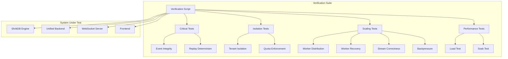

# Design Document: Phase 3 Production Verification

## Overview

This design specifies the verification system for Phase 3 production readiness. The system implements a comprehensive test suite that validates all production requirements through property-based tests, example tests, and integration scenarios. The verification follows a "fail-fast" approach where critical tests (event integrity, replay determinism) run first.

The verification system is implemented in TypeScript/JavaScript using fast-check for property-based testing and Jest as the test runner. Go tests are used for ShrikDB-specific verification.

## Architecture



## Components and Interfaces

### VerificationRunner

The main orchestrator that executes all verification tests in order.

```typescript
interface VerificationRunner {
  runAll(): Promise<VerificationReport>;
  runCritical(): Promise<VerificationReport>;
  runCategory(category: TestCategory): Promise<VerificationReport>;
}

type TestCategory = 
  | 'event-integrity'
  | 'replay-determinism'
  | 'tenant-isolation'
  | 'quota-enforcement'
  | 'worker-distribution'
  | 'worker-recovery'
  | 'stream-correctness'
  | 'backpressure'
  | 'websocket'
  | 'auth'
  | 'load-test'
  | 'soak-test'
  | 'observability';
```

### VerificationReport

The structured output format for verification results.

```typescript
interface VerificationReport {
  timestamp: string;
  duration_ms: number;
  overall: 'PASS' | 'FAIL';
  categories: CategoryResult[];
  critical_failures: string[];
}

interface CategoryResult {
  name: string;
  status: 'PASS' | 'FAIL' | 'SKIP';
  tests: TestResult[];
  duration_ms: number;
}

interface TestResult {
  name: string;
  status: 'PASS' | 'FAIL' | 'SKIP';
  property_id?: string;
  requirement_ids: string[];
  error?: string;
  duration_ms: number;
}
```

### TestHelpers

Utility functions for common verification operations.

```typescript
interface TestHelpers {
  // Event operations
  appendEvents(count: number, projectId: string): Promise<Event[]>;
  getEventSequence(projectId: string): Promise<number[]>;
  
  // Replay operations
  deleteProjections(projectId: string): Promise<void>;
  triggerReplay(projectId: string, fromSeq: number): Promise<void>;
  getProjectionState(projectId: string): Promise<ProjectionState>;
  
  // Worker operations
  startWorkers(count: number): Promise<WorkerInfo[]>;
  killWorker(workerId: string): Promise<void>;
  getPartitionAssignments(): Promise<PartitionAssignment[]>;
  
  // Tenant operations
  createAccount(): Promise<AccountCredentials>;
  createProject(accountId: string): Promise<ProjectCredentials>;
  
  // WebSocket operations
  connectWebSocket(credentials: Credentials): Promise<WebSocket>;
  waitForMessage(ws: WebSocket, timeout: number): Promise<Message>;
}
```

## Data Models

### Event

```typescript
interface Event {
  sequence: number;
  project_id: string;
  event_type: string;
  payload: Record<string, unknown>;
  timestamp: string;
  checksum: string;
}
```

### WorkerInfo

```typescript
interface WorkerInfo {
  worker_id: string;
  status: 'active' | 'inactive' | 'failed';
  partitions: string[];
  last_heartbeat: string;
  processed_count: number;
}
```

### PartitionAssignment

```typescript
interface PartitionAssignment {
  partition_key: string;
  worker_id: string;
  assigned_at: string;
  last_processed_seq: number;
}
```

## Correctness Properties

*A property is a characteristic or behavior that should hold true across all valid executions of a system—essentially, a formal statement about what the system should do. Properties serve as the bridge between human-readable specifications and machine-verifiable correctness guarantees.*

### Property 1: Event Sequence Integrity

*For any* number of events N appended to a project, the resulting sequence numbers SHALL be strictly increasing, contiguous (no gaps), and unique.

**Validates: Requirements 1.1, 1.2, 1.3**

### Property 2: Replay Determinism

*For any* project state, deleting all projections and replaying from sequence=0 SHALL produce bit-for-bit identical projection state, regardless of wall-clock time or process restarts.

**Validates: Requirements 2.1, 2.2, 2.3, 2.4**

### Property 3: Cross-Tenant Data Isolation

*For any* two distinct accounts A and B, when A writes events to Project A, account B SHALL receive 403 Forbidden when attempting to read those events, and the attempt SHALL be logged as a security event.

**Validates: Requirements 3.1, 3.2, 3.4, 3.5**

### Property 4: Replay Isolation

*For any* two distinct projects A and B, replaying Project A SHALL NOT modify any state in Project B.

**Validates: Requirements 3.3**

### Property 5: Quota Enforcement with Tenant Isolation

*For any* tenant exceeding their rate limit, the system SHALL return 429 Too Many Requests while other tenants maintain normal throughput and latency.

**Validates: Requirements 4.1, 4.2, 4.3, 4.4, 4.5**

### Property 6: Deterministic Partition Assignment

*For any* configuration of N workers, the partition assignment SHALL be identical across multiple starts, restarts, and replays, and each event SHALL be processed by exactly one worker.

**Validates: Requirements 5.1, 5.2, 5.3, 5.4, 5.5**

### Property 7: Worker Failure Recovery

*For any* worker killed mid-processing, the system SHALL recover with no lost events, no duplicate processing, and processing SHALL resume from the last committed checkpoint.

**Validates: Requirements 6.1, 6.2, 6.4**

### Property 8: Stream Delivery and Offset Persistence

*For any* stream with multiple consumer groups, messages SHALL be delivered to all groups, offsets SHALL be tracked independently per group, and replay SHALL restore offsets correctly.

**Validates: Requirements 7.1, 7.2, 7.3, 7.4, 7.5**

### Property 9: Backpressure Safety

*For any* system under write flood conditions, backpressure SHALL apply controlled rejection without memory leaks, silent event drops, or unclear error messages.

**Validates: Requirements 8.1, 8.2, 8.3, 8.4, 8.5**

### Property 10: WebSocket Real-Time Delivery

*For any* authenticated WebSocket client, events appended to the system SHALL be broadcast in real-time, and all data SHALL originate from the actual event log (no mock data).

**Validates: Requirements 9.1, 9.2, 9.3, 9.4, 9.5**

### Property 11: Failure Visibility and Auto-Reconnection

*For any* service failure, the system SHALL display accurate failure status (no fake green), and frontend SHALL auto-reconnect when service recovers.

**Validates: Requirements 10.2, 10.3, 10.4, 10.5**

### Property 12: Authentication Consistency

*For any* credential state (valid, invalid, expired), access decisions SHALL be consistent across HTTP and WebSocket interfaces, with no anonymous access or auth bypass possible.

**Validates: Requirements 11.1, 11.2, 11.3, 11.4, 11.5**

### Property 13: Metrics Accuracy

*For any* operation (append, replay, failure), metrics SHALL accurately reflect the operation count and WAL state, with no silent errors or synthetic values.

**Validates: Requirements 14.1, 14.2, 14.3, 14.4, 14.5**

## Error Handling

### Critical Failure Handling

When critical tests fail (event integrity, replay determinism), the verification suite SHALL:
1. Stop execution immediately
2. Report the failure with full context
3. Mark overall result as FAIL
4. Include the failure in `critical_failures` array

### Non-Critical Failure Handling

When non-critical tests fail, the verification suite SHALL:
1. Continue execution of remaining tests
2. Record the failure in the category result
3. Mark overall result as FAIL only if no critical failures exist

### Timeout Handling

All tests SHALL have configurable timeouts:
- Property tests: 30 seconds per property
- Load tests: 35 minutes (30 min test + 5 min setup/teardown)
- Soak tests: Configurable (default 8 hours)

## Testing Strategy

### Property-Based Tests

Property-based tests use fast-check with minimum 100 iterations per property. Each test is tagged with its property number and requirement references.

```typescript
// Example property test structure
describe('Event Sequence Integrity', () => {
  it('Property 1: sequence numbers are strictly increasing, contiguous, and unique', async () => {
    await fc.assert(
      fc.asyncProperty(
        fc.integer({ min: 1, max: 1000 }),
        async (eventCount) => {
          const events = await helpers.appendEvents(eventCount, projectId);
          const sequences = events.map(e => e.sequence);
          
          // Strictly increasing
          for (let i = 1; i < sequences.length; i++) {
            expect(sequences[i]).toBeGreaterThan(sequences[i - 1]);
          }
          
          // Contiguous (no gaps)
          for (let i = 1; i < sequences.length; i++) {
            expect(sequences[i]).toBe(sequences[i - 1] + 1);
          }
          
          // Unique
          expect(new Set(sequences).size).toBe(sequences.length);
        }
      ),
      { numRuns: 100 }
    );
  });
});
```

### Example Tests

Example tests cover specific scenarios that are not suitable for property-based testing:

1. **Crash Safety Test** (Req 1.4): Kill process mid-append, verify WAL integrity
2. **Disconnect Detection Test** (Req 10.1): Kill backend, verify UI shows disconnect within 5 seconds
3. **Load Test** (Req 12.x): Sustain write load for 30 minutes, verify performance metrics
4. **Soak Test** (Req 13.x): Run system for extended duration, verify stability

### Integration Tests

Integration tests verify end-to-end flows:

1. **Full Verification Suite**: Run all tests in order, produce JSON report
2. **Kill/Restart/Replay Cycle**: Kill all services, restart, replay, verify state
3. **Multi-Tenant Load**: Multiple tenants under load, verify isolation

### Test Execution Order

1. **Critical Tests** (fail-fast)
   - Event Sequence Integrity
   - Replay Determinism
   
2. **Isolation Tests**
   - Cross-Tenant Data Isolation
   - Replay Isolation
   - Quota Enforcement
   
3. **Scaling Tests**
   - Deterministic Partition Assignment
   - Worker Failure Recovery
   - Stream Delivery
   - Backpressure Safety
   
4. **Connectivity Tests**
   - WebSocket Real-Time Delivery
   - Failure Visibility
   - Authentication Consistency
   
5. **Observability Tests**
   - Metrics Accuracy
   
6. **Performance Tests** (optional, long-running)
   - Load Test (30 min)
   - Soak Test (configurable)
