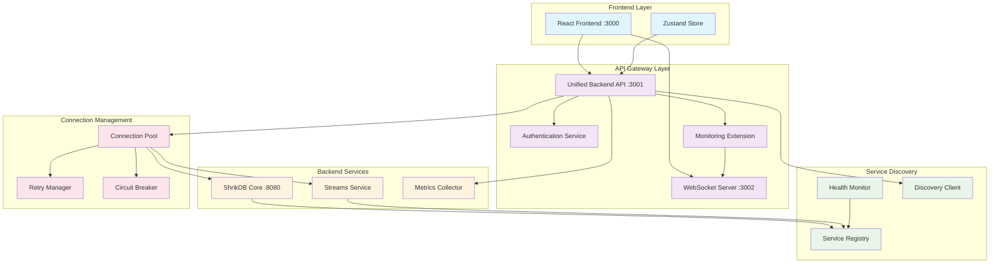
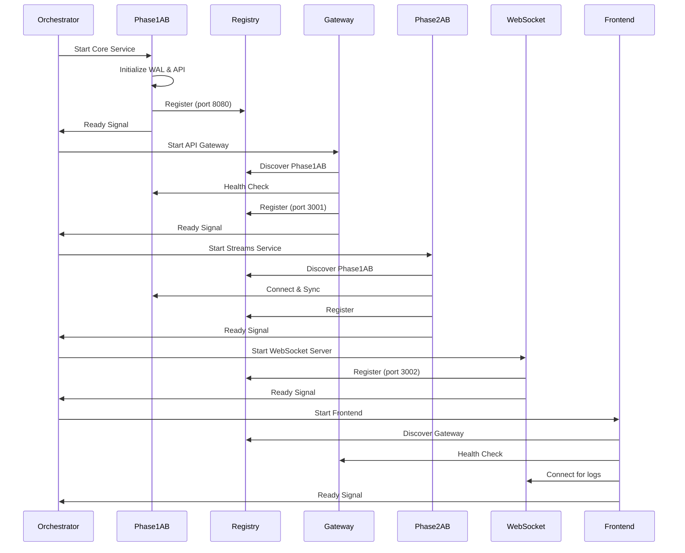

# Design Document

## Overview

The Service Connectivity & Health Management system addresses critical connectivity failures in the ShrikDB ecosystem by implementing robust service orchestration, authentication restoration, and real-time monitoring. The design focuses on fixing the immediate issues: HTTP 500 authentication errors, WebSocket connection failures, missing API endpoints, and service startup dependencies.

The solution implements a layered architecture with service discovery, health monitoring, connection pooling, and automatic recovery mechanisms. All services follow a dependency-aware startup sequence, maintain persistent connections with retry logic, and provide comprehensive observability for troubleshooting.

## Architecture

### Service Connectivity Architecture



### Service Startup Sequence



## Components and Interfaces

### Service Orchestrator

Manages the startup sequence and dependency resolution:

```javascript
class ServiceOrchestrator {
  constructor(config) {
    this.config = config;
    this.services = new Map();
    this.startupOrder = [
      'phase1ab',
      'gateway', 
      'phase2ab',
      'websocket',
      'frontend'
    ];
  }

  // Service lifecycle management
  async startAllServices() {
    for (const serviceName of this.startupOrder) {
      await this.startService(serviceName);
      await this.waitForHealthy(serviceName);
    }
  }

  async startService(serviceName) {
    const serviceConfig = this.config.services[serviceName];
    const process = spawn(serviceConfig.command, serviceConfig.args, {
      cwd: serviceConfig.workingDir,
      env: { ...process.env, ...serviceConfig.env }
    });
    
    this.services.set(serviceName, {
      process,
      config: serviceConfig,
      status: 'starting',
      startTime: Date.now()
    });
    
    return new Promise((resolve, reject) => {
      const timeout = setTimeout(() => {
        reject(new Error(`Service ${serviceName} failed to start within timeout`));
      }, serviceConfig.startupTimeout || 30000);
      
      process.stdout.on('data', (data) => {
        const message = data.toString();
        if (message.includes(serviceConfig.readySignal)) {
          clearTimeout(timeout);
          this.services.get(serviceName).status = 'running';
          resolve();
        }
      });
      
      process.on('error', (error) => {
        clearTimeout(timeout);
        reject(error);
      });
    });
  }

  async waitForHealthy(serviceName) {
    const service = this.services.get(serviceName);
    const healthUrl = service.config.healthUrl;
    
    if (!healthUrl) return; // Skip health check if no URL provided
    
    const maxRetries = 30;
    for (let i = 0; i < maxRetries; i++) {
      try {
        const response = await axios.get(healthUrl, { timeout: 5000 });
        if (response.status === 200) {
          console.log(`✅ Service ${serviceName} is healthy`);
          return;
        }
      } catch (error) {
        console.log(`⏳ Waiting for ${serviceName} to be healthy (${i + 1}/${maxRetries})`);
        await new Promise(resolve => setTimeout(resolve, 1000));
      }
    }
    
    throw new Error(`Service ${serviceName} failed health check after ${maxRetries} attempts`);
  }

  async stopAllServices() {
    // Stop in reverse order
    const reverseOrder = [...this.startupOrder].reverse();
    
    for (const serviceName of reverseOrder) {
      await this.stopService(serviceName);
    }
  }

  async stopService(serviceName) {
    const service = this.services.get(serviceName);
    if (service && service.process) {
      service.process.kill('SIGTERM');
      service.status = 'stopping';
      
      // Wait for graceful shutdown
      await new Promise(resolve => {
        service.process.on('exit', resolve);
        setTimeout(() => {
          service.process.kill('SIGKILL');
          resolve();
        }, 10000);
      });
      
      service.status = 'stopped';
    }
  }

  getServiceStatus() {
    const status = {};
    for (const [name, service] of this.services) {
      status[name] = {
        status: service.status,
        pid: service.process?.pid,
        startTime: service.startTime,
        uptime: service.startTime ? Date.now() - service.startTime : 0
      };
    }
    return status;
  }
}
```

### Authentication Service

Fixes the HTTP 500 authentication errors:

```javascript
class AuthenticationService {
  constructor(config) {
    this.config = config;
    this.sessions = new Map();
    this.projects = new Map();
    this.setupDefaultProjects();
  }

  setupDefaultProjects() {
    // Create default projects for development
    this.projects.set('demo-client', {
      clientId: 'demo-client',
      clientKey: 'demo-key',
      projectId: 'demo-project',
      permissions: ['read', 'write', 'admin']
    });
  }

  async validateCredentials(clientId, clientKey) {
    const project = this.projects.get(clientId);
    
    if (!project) {
      throw new AuthenticationError('Invalid client ID', 401);
    }
    
    if (project.clientKey !== clientKey) {
      throw new AuthenticationError('Invalid client key', 401);
    }
    
    return project;
  }

  async createSession(clientId, clientKey) {
    const project = await this.validateCredentials(clientId, clientKey);
    
    const sessionId = uuidv4();
    const session = {
      sessionId,
      clientId,
      projectId: project.projectId,
      permissions: project.permissions,
      createdAt: Date.now(),
      lastAccess: Date.now()
    };
    
    this.sessions.set(sessionId, session);
    
    return {
      sessionId,
      projectId: project.projectId,
      permissions: project.permissions,
      expiresIn: 3600000 // 1 hour
    };
  }

  async validateSession(sessionId) {
    const session = this.sessions.get(sessionId);
    
    if (!session) {
      throw new AuthenticationError('Invalid session', 401);
    }
    
    // Check expiration
    if (Date.now() - session.lastAccess > 3600000) {
      this.sessions.delete(sessionId);
      throw new AuthenticationError('Session expired', 401);
    }
    
    // Update last access
    session.lastAccess = Date.now();
    
    return session;
  }

  // Middleware for Express
  createAuthMiddleware() {
    return async (req, res, next) => {
      try {
        const clientId = req.headers['x-client-id'];
        const clientKey = req.headers['x-client-key'];
        const sessionId = req.headers['authorization']?.replace('Bearer ', '');
        
        let session;
        
        if (sessionId) {
          // Validate existing session
          session = await this.validateSession(sessionId);
        } else if (clientId && clientKey) {
          // Create new session
          const sessionData = await this.createSession(clientId, clientKey);
          session = {
            projectId: sessionData.projectId,
            permissions: sessionData.permissions
          };
          res.setHeader('X-Session-ID', sessionData.sessionId);
        } else {
          throw new AuthenticationError('Missing authentication credentials', 401);
        }
        
        req.auth = session;
        next();
        
      } catch (error) {
        if (error instanceof AuthenticationError) {
          res.status(error.statusCode).json({
            error: error.message,
            code: 'AUTHENTICATION_FAILED'
          });
        } else {
          console.error('Authentication middleware error:', error);
          res.status(500).json({
            error: 'Internal authentication error',
            code: 'AUTH_INTERNAL_ERROR'
          });
        }
      }
    };
  }
}

class AuthenticationError extends Error {
  constructor(message, statusCode) {
    super(message);
    this.name = 'AuthenticationError';
    this.statusCode = statusCode;
  }
}
```

### WebSocket Server

Fixes the WebSocket connection failures:

```javascript
class WebSocketServer {
  constructor(config) {
    this.config = {
      port: 3002,
      path: '/ws/logs',
      ...config
    };
    this.clients = new Set();
    this.logBuffer = [];
    this.maxBufferSize = 1000;
  }

  start() {
    return new Promise((resolve, reject) => {
      try {
        this.wss = new WebSocket.Server({
          port: this.config.port,
          path: this.config.path
        });

        this.wss.on('connection', (ws, req) => {
          console.log(`WebSocket client connected from ${req.socket.remoteAddress}`);
          
          this.clients.add(ws);
          
          // Send buffered logs to new client
          this.logBuffer.forEach(log => {
            if (ws.readyState === WebSocket.OPEN) {
              ws.send(JSON.stringify(log));
            }
          });
          
          ws.on('close', () => {
            console.log('WebSocket client disconnected');
            this.clients.delete(ws);
          });
          
          ws.on('error', (error) => {
            console.error('WebSocket client error:', error);
            this.clients.delete(ws);
          });
          
          // Send ping to keep connection alive
          const pingInterval = setInterval(() => {
            if (ws.readyState === WebSocket.OPEN) {
              ws.ping();
            } else {
              clearInterval(pingInterval);
            }
          }, 30000);
        });

        this.wss.on('listening', () => {
          console.log(`✅ WebSocket server listening on port ${this.config.port}`);
          resolve();
        });

        this.wss.on('error', (error) => {
          console.error('WebSocket server error:', error);
          reject(error);
        });

      } catch (error) {
        reject(error);
      }
    });
  }

  broadcast(logEntry) {
    const message = {
      timestamp: new Date().toISOString(),
      level: logEntry.level || 'info',
      service: logEntry.service || 'unknown',
      message: logEntry.message,
      data: logEntry.data || {}
    };
    
    // Add to buffer
    this.logBuffer.push(message);
    if (this.logBuffer.length > this.maxBufferSize) {
      this.logBuffer.shift();
    }
    
    // Broadcast to all connected clients
    const messageStr = JSON.stringify(message);
    this.clients.forEach(client => {
      if (client.readyState === WebSocket.OPEN) {
        client.send(messageStr);
      }
    });
  }

  stop() {
    if (this.wss) {
      this.wss.close();
      this.clients.clear();
    }
  }
}
```

### Connection Pool Manager

Manages persistent connections with retry logic:

```javascript
class ConnectionPoolManager {
  constructor(config) {
    this.config = config;
    this.pools = new Map();
    this.retryManager = new RetryManager();
    this.circuitBreaker = new CircuitBreaker();
  }

  async getConnection(serviceName) {
    let pool = this.pools.get(serviceName);
    
    if (!pool) {
      pool = await this.createPool(serviceName);
      this.pools.set(serviceName, pool);
    }
    
    return pool.getConnection();
  }

  async createPool(serviceName) {
    const serviceConfig = this.config.services[serviceName];
    
    return new ConnectionPool({
      serviceName,
      baseUrl: serviceConfig.url,
      maxConnections: serviceConfig.maxConnections || 10,
      connectionTimeout: serviceConfig.connectionTimeout || 5000,
      retryManager: this.retryManager,
      circuitBreaker: this.circuitBreaker
    });
  }

  async makeRequest(serviceName, options) {
    const pool = await this.getConnection(serviceName);
    
    return this.retryManager.execute(async () => {
      if (this.circuitBreaker.isOpen(serviceName)) {
        throw new Error(`Circuit breaker open for ${serviceName}`);
      }
      
      try {
        const response = await pool.request(options);
        this.circuitBreaker.recordSuccess(serviceName);
        return response;
      } catch (error) {
        this.circuitBreaker.recordFailure(serviceName);
        throw error;
      }
    });
  }
}

class ConnectionPool {
  constructor(config) {
    this.config = config;
    this.connections = [];
    this.activeConnections = 0;
  }

  async getConnection() {
    if (this.connections.length > 0) {
      return this.connections.pop();
    }
    
    if (this.activeConnections < this.config.maxConnections) {
      return this.createConnection();
    }
    
    // Wait for available connection
    return new Promise((resolve) => {
      const checkForConnection = () => {
        if (this.connections.length > 0) {
          resolve(this.connections.pop());
        } else {
          setTimeout(checkForConnection, 100);
        }
      };
      checkForConnection();
    });
  }

  async createConnection() {
    this.activeConnections++;
    
    const axiosInstance = axios.create({
      baseURL: this.config.baseUrl,
      timeout: this.config.connectionTimeout,
      headers: {
        'Connection': 'keep-alive',
        'Keep-Alive': 'timeout=5, max=1000'
      }
    });
    
    return {
      request: axiosInstance.request.bind(axiosInstance),
      release: () => {
        this.connections.push(this);
      },
      destroy: () => {
        this.activeConnections--;
      }
    };
  }
}

class RetryManager {
  constructor(config = {}) {
    this.maxRetries = config.maxRetries || 3;
    this.baseDelay = config.baseDelay || 1000;
    this.maxDelay = config.maxDelay || 10000;
  }

  async execute(operation) {
    let lastError;
    
    for (let attempt = 0; attempt <= this.maxRetries; attempt++) {
      try {
        return await operation();
      } catch (error) {
        lastError = error;
        
        if (attempt === this.maxRetries) {
          break;
        }
        
        const delay = Math.min(
          this.baseDelay * Math.pow(2, attempt),
          this.maxDelay
        );
        
        console.log(`Retry attempt ${attempt + 1} after ${delay}ms delay`);
        await new Promise(resolve => setTimeout(resolve, delay));
      }
    }
    
    throw lastError;
  }
}

class CircuitBreaker {
  constructor(config = {}) {
    this.failureThreshold = config.failureThreshold || 5;
    this.resetTimeout = config.resetTimeout || 60000;
    this.states = new Map();
  }

  isOpen(serviceName) {
    const state = this.getState(serviceName);
    
    if (state.status === 'open') {
      if (Date.now() - state.lastFailure > this.resetTimeout) {
        state.status = 'half-open';
        state.failures = 0;
      }
      return state.status === 'open';
    }
    
    return false;
  }

  recordSuccess(serviceName) {
    const state = this.getState(serviceName);
    state.failures = 0;
    state.status = 'closed';
  }

  recordFailure(serviceName) {
    const state = this.getState(serviceName);
    state.failures++;
    state.lastFailure = Date.now();
    
    if (state.failures >= this.failureThreshold) {
      state.status = 'open';
    }
  }

  getState(serviceName) {
    if (!this.states.has(serviceName)) {
      this.states.set(serviceName, {
        status: 'closed',
        failures: 0,
        lastFailure: 0
      });
    }
    return this.states.get(serviceName);
  }
}
```

### Health Monitor

Provides comprehensive health checking:

```javascript
class HealthMonitor {
  constructor(config) {
    this.config = config;
    this.healthChecks = new Map();
    this.healthStatus = new Map();
    this.checkInterval = config.checkInterval || 30000;
  }

  registerService(serviceName, healthCheck) {
    this.healthChecks.set(serviceName, healthCheck);
    this.healthStatus.set(serviceName, {
      status: 'unknown',
      lastCheck: 0,
      lastSuccess: 0,
      consecutiveFailures: 0
    });
  }

  start() {
    this.intervalId = setInterval(() => {
      this.runHealthChecks();
    }, this.checkInterval);
    
    // Run initial health checks
    this.runHealthChecks();
  }

  stop() {
    if (this.intervalId) {
      clearInterval(this.intervalId);
    }
  }

  async runHealthChecks() {
    const promises = [];
    
    for (const [serviceName, healthCheck] of this.healthChecks) {
      promises.push(this.checkService(serviceName, healthCheck));
    }
    
    await Promise.allSettled(promises);
  }

  async checkService(serviceName, healthCheck) {
    const status = this.healthStatus.get(serviceName);
    
    try {
      const result = await healthCheck();
      
      status.status = 'healthy';
      status.lastCheck = Date.now();
      status.lastSuccess = Date.now();
      status.consecutiveFailures = 0;
      status.details = result;
      
      console.log(`✅ Health check passed for ${serviceName}`);
      
    } catch (error) {
      status.status = 'unhealthy';
      status.lastCheck = Date.now();
      status.consecutiveFailures++;
      status.error = error.message;
      
      console.error(`❌ Health check failed for ${serviceName}:`, error.message);
      
      // Trigger alerts for persistent failures
      if (status.consecutiveFailures >= 3) {
        this.triggerAlert(serviceName, status);
      }
    }
  }

  triggerAlert(serviceName, status) {
    console.error(`🚨 ALERT: Service ${serviceName} has failed ${status.consecutiveFailures} consecutive health checks`);
    
    // Here you could integrate with alerting systems
    // - Send email notifications
    // - Post to Slack
    // - Create incident tickets
    // - Trigger auto-recovery
  }

  getHealthStatus(serviceName) {
    if (serviceName) {
      return this.healthStatus.get(serviceName);
    }
    
    const allStatus = {};
    for (const [name, status] of this.healthStatus) {
      allStatus[name] = status;
    }
    return allStatus;
  }

  isSystemHealthy() {
    for (const [, status] of this.healthStatus) {
      if (status.status !== 'healthy') {
        return false;
      }
    }
    return true;
  }
}
```

## Data Models

### Service Configuration Model

```javascript
const ServiceConfig = {
  services: {
    phase1ab: {
      command: './shrikdb.exe',
      args: [],
      workingDir: './shrikdb',
      env: {
        SHRIKDB_ENV: 'development',
        SHRIKDB_PORT: '8080'
      },
      healthUrl: 'http://localhost:8080/health',
      readySignal: 'ShrikDB ready',
      startupTimeout: 30000,
      url: 'http://localhost:8080',
      maxConnections: 10,
      connectionTimeout: 5000
    },
    gateway: {
      command: 'node',
      args: ['server.js'],
      workingDir: '.',
      env: {
        PORT: '3001',
        SHRIKDB_URL: 'http://localhost:8080',
        CORS_ORIGIN: 'http://localhost:3000'
      },
      healthUrl: 'http://localhost:3001/health',
      readySignal: 'Server started successfully',
      startupTimeout: 15000,
      url: 'http://localhost:3001',
      maxConnections: 20,
      connectionTimeout: 5000
    },
    websocket: {
      command: 'node',
      args: ['-e', 'require("./monitoring-api-extension").startWebSocketServer()'],
      workingDir: '.',
      env: {
        WS_PORT: '3002'
      },
      healthUrl: 'ws://localhost:3002/ws/logs',
      readySignal: 'WebSocket server listening',
      startupTimeout: 10000,
      url: 'ws://localhost:3002',
      maxConnections: 50,
      connectionTimeout: 3000
    },
    frontend: {
      command: 'npm',
      args: ['run', 'dev'],
      workingDir: '.',
      env: {
        PORT: '3000',
        VITE_API_URL: 'http://localhost:3001',
        BROWSER: 'none'
      },
      healthUrl: 'http://localhost:3000',
      readySignal: 'ready',
      startupTimeout: 45000,
      url: 'http://localhost:3000',
      maxConnections: 5,
      connectionTimeout: 10000
    }
  },
  
  healthChecks: {
    checkInterval: 30000,
    failureThreshold: 3,
    alertThreshold: 5
  },
  
  connectionPool: {
    maxRetries: 3,
    baseDelay: 1000,
    maxDelay: 10000,
    circuitBreakerThreshold: 5,
    circuitBreakerTimeout: 60000
  }
};
```

### Health Status Model

```javascript
const HealthStatusModel = {
  serviceName: 'string',
  status: 'healthy | unhealthy | unknown',
  lastCheck: 'timestamp',
  lastSuccess: 'timestamp',
  consecutiveFailures: 'number',
  uptime: 'number',
  responseTime: 'number',
  details: {
    version: 'string',
    dependencies: 'object',
    metrics: 'object'
  },
  error: 'string'
};
```

Now I need to use the prework tool to analyze the acceptance criteria before writing the correctness properties:

<function_calls>
<invoke name="prework">
<parameter name="featureName">service-connectivity-health

## Correctness Properties

*A property is a characteristic or behavior that should hold true across all valid executions of a system-essentially, a formal statement about what the system should do. Properties serve as the bridge between human-readable specifications and machine-verifiable correctness guarantees.*

### Property Reflection

After analyzing all acceptance criteria, several properties can be consolidated to eliminate redundancy:

- Authentication properties (1.1, 1.2, 1.3, 1.4) can be combined into comprehensive authentication behavior properties
- Health check properties (5.1, 5.2, 5.3, 5.4, 5.5) can be combined into a single comprehensive health monitoring property
- Connection management properties (6.1, 6.2, 6.3, 6.4, 6.5) can be combined into connection pool behavior properties
- Service discovery properties (7.1, 7.2, 7.3, 7.4, 7.5) can be combined into service registry consistency properties
- Error recovery properties (8.1, 8.2, 8.3, 8.4, 8.5) can be combined into automatic recovery behavior properties

### Core Connectivity Properties

**Property 1: Authentication Service Correctness**
*For any* client credentials (valid or invalid), the authentication service should validate them correctly, return appropriate status codes (401 for failures, not 500), and maintain session state consistently
**Validates: Requirements 1.1, 1.2, 1.3, 1.4**

**Property 2: Authentication Persistence Recovery**
*For any* authentication state created before a system restart, the authentication service should restore that state correctly from persistent storage after restart
**Validates: Requirements 1.5**

**Property 3: WebSocket Connection Establishment**
*For any* client attempting to connect to ws://localhost:3002/ws/logs, the WebSocket server should establish the connection successfully and maintain it with proper error handling
**Validates: Requirements 2.2, 2.4**

**Property 4: WebSocket Real-Time Broadcasting**
*For any* log event that occurs in the system, all connected WebSocket clients should receive the event in real-time without data loss
**Validates: Requirements 2.3**

**Property 5: WebSocket Automatic Reconnection**
*For any* WebSocket server restart, existing clients should automatically reconnect and resume receiving log events
**Validates: Requirements 2.5**

**Property 6: API Endpoint Availability**
*For any* documented API endpoint, the system should return appropriate responses (not 404) with proper error handling and functionality
**Validates: Requirements 3.5**

**Property 7: Service Startup Dependency Order**
*For any* system startup, services should initialize in the correct dependency order (Phase 1AB → Gateway → Phase 2AB → WebSocket → Frontend) with proper health verification at each step
**Validates: Requirements 4.1, 4.2, 4.3, 4.4**

**Property 8: Service Startup Failure Handling**
*For any* service that fails to start, the system should provide clear error messages and stop dependent services to prevent cascade failures
**Validates: Requirements 4.5**

**Property 9: Comprehensive Health Monitoring**
*For any* health check execution, the system should verify service availability, authentication functionality, WebSocket connectivity, and database access, logging detailed failure information when checks fail
**Validates: Requirements 5.1, 5.2, 5.3, 5.4, 5.5**

**Property 10: Connection Pool Reliability**
*For any* inter-service communication, the connection pool should maintain persistent connections with automatic reconnection, implement exponential backoff retry strategies, and handle overflow gracefully
**Validates: Requirements 6.1, 6.2, 6.3, 6.4, 6.5**

**Property 11: Service Discovery Consistency**
*For any* service registration, status change, or endpoint update, the service discovery system should maintain consistent registry state and propagate changes to all dependent services
**Validates: Requirements 7.1, 7.2, 7.3, 7.4, 7.5**

**Property 12: Automatic Error Recovery**
*For any* system error (HTTP 500, WebSocket disconnection, API failures, token expiration, unresponsive services), the system should implement appropriate recovery strategies with logging and retry mechanisms
**Validates: Requirements 8.1, 8.2, 8.3, 8.4, 8.5**

**Property 13: Comprehensive Observability**
*For any* system operation, the monitoring system should log requests with correlation IDs, record metrics for performance tracking, and generate alerts with actionable troubleshooting information
**Validates: Requirements 9.1, 9.2, 9.3, 9.5**

**Property 14: Configuration Management Reliability**
*For any* configuration change, the system should load settings from central configuration, support hot-reloading without restarts, handle environment-specific overrides, and validate settings before application
**Validates: Requirements 10.1, 10.2, 10.3, 10.4, 10.5**

**Property 15: Load Balancing and Failover**
*For any* service with multiple instances, the system should distribute load across healthy instances, automatically route traffic during failures, queue requests during complete outages, and maintain session state during failover
**Validates: Requirements 11.1, 11.2, 11.3, 11.4, 11.5**

**Property 16: Security and Authentication Integration**
*For any* service communication (internal or external), the system should enforce proper authentication, validate credentials, implement rate limiting, handle token lifecycle, and respond to security violations appropriately
**Validates: Requirements 12.1, 12.2, 12.3, 12.4, 12.5**

### Verification Properties (Examples)

**Example 1: WebSocket Server Startup**
When the WebSocket server starts, it should bind to port 3002 and accept connections successfully
**Validates: Requirements 2.1**

**Example 2: Service Start-All Endpoint**
When the frontend calls /api/services/start-all, the API gateway should provide a valid endpoint that starts all services
**Validates: Requirements 3.1**

**Example 3: Service Stop-All Endpoint**
When the frontend calls /api/services/stop-all, the API gateway should provide a valid endpoint that stops all services
**Validates: Requirements 3.2**

**Example 4: Phase 3B Test Endpoint**
When the frontend calls /api/tests/phase3b, the API gateway should provide a valid endpoint for running Phase 3B tests
**Validates: Requirements 3.3**

**Example 5: Noisy Neighbor Test Endpoint**
When the frontend calls /api/tests/noisy-neighbor, the API gateway should provide a valid endpoint for noisy neighbor tests
**Validates: Requirements 3.4**

**Example 6: Monitoring Dashboard Display**
When the monitoring dashboard loads, it should display real-time connectivity status for all services
**Validates: Requirements 9.4**

## Error Handling

### Authentication Error Categories

**Credential Validation Errors:**
- Invalid client ID: Return 401 with clear message
- Invalid client key: Return 401 with clear message  
- Missing credentials: Return 401 with guidance
- Malformed credentials: Return 400 with format requirements

**Session Management Errors:**
- Expired sessions: Return 401 and trigger automatic refresh
- Invalid session tokens: Return 401 and clear local storage
- Session storage failures: Log error and fallback to credential auth
- Concurrent session conflicts: Handle gracefully with last-writer-wins

### Connection Error Categories

**WebSocket Connection Errors:**
- Port binding failures: Log detailed error and suggest port alternatives
- Client connection drops: Implement automatic reconnection with exponential backoff
- Message broadcast failures: Queue messages and retry delivery
- Server restart scenarios: Notify clients and trigger reconnection

**HTTP Connection Errors:**
- Service unavailability: Implement circuit breaker and retry logic
- Timeout errors: Adjust timeouts based on service characteristics
- Network partitions: Queue requests and replay when connectivity restored
- Load balancer failures: Failover to backup instances automatically

### Service Startup Error Categories

**Dependency Failures:**
- Missing dependencies: Provide clear error messages with resolution steps
- Port conflicts: Detect conflicts and suggest alternative ports
- Configuration errors: Validate configuration and fail fast with specific errors
- Resource constraints: Monitor resources and provide capacity guidance

**Health Check Failures:**
- Service unresponsive: Implement progressive retry with increasing delays
- Partial functionality: Allow degraded operation with clear status indication
- Cascading failures: Implement circuit breakers to prevent system-wide outages
- Recovery scenarios: Automatic restart with backoff and manual override options

## Testing Strategy

### Dual Testing Approach

The connectivity testing strategy employs both unit tests and property-based tests:

**Unit Tests:**
- Specific authentication scenarios (valid/invalid credentials)
- WebSocket connection establishment and error cases
- Service startup sequence edge cases
- Health check failure scenarios
- Configuration validation edge cases

**Property-Based Tests:**
- Authentication behavior across all possible credential combinations
- Connection pool behavior under various load and failure conditions
- Service discovery consistency across random service state changes
- Error recovery behavior across random failure scenarios
- Configuration management across random configuration changes

### Property-Based Testing Configuration

**Testing Framework:**
- JavaScript: Use `fast-check` for property-based testing
- Node.js: Use `tap` or `jest` for unit testing framework
- WebSocket: Use `ws` library for connection testing

**Test Configuration:**
- Minimum 100 iterations per property test
- Each property test references its design document property
- Tag format: **Feature: service-connectivity-health, Property {number}: {property_text}**

### Integration Test Categories

**Service Orchestration Tests:**
- Complete system startup and shutdown sequences
- Dependency failure and recovery scenarios
- Service health monitoring and alerting
- Configuration hot-reloading without service interruption

**Authentication Integration Tests:**
- End-to-end authentication flows from frontend to backend
- Session management across service restarts
- Token refresh and expiration handling
- Multi-user concurrent authentication scenarios

**Connection Management Tests:**
- Connection pool behavior under high load
- Network partition and recovery scenarios
- Circuit breaker activation and reset
- WebSocket connection stability under various network conditions

**Monitoring and Observability Tests:**
- Log aggregation and real-time streaming
- Correlation ID propagation across service boundaries
- Health check accuracy and alerting
- Performance metrics collection and reporting

### Verification Script Requirements

The verification script must:
- Start all services in correct dependency order
- Verify authentication works end-to-end
- Test WebSocket connectivity and real-time log streaming
- Validate all API endpoints return appropriate responses
- Simulate failure scenarios and verify recovery
- Generate comprehensive connectivity report
- Output machine-verifiable assertions (JSON with pass/fail)