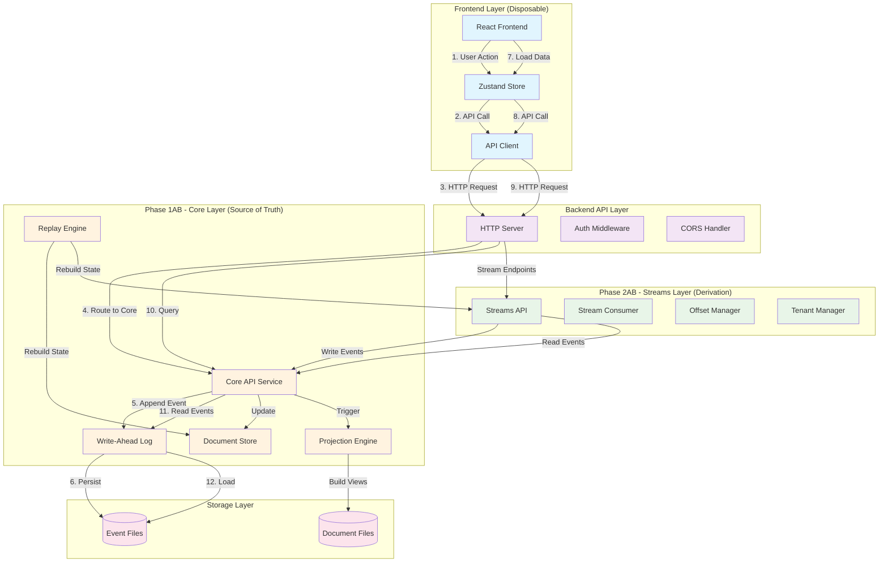

# Design Document

## Overview

The ShrikDB Complete Integration design creates a production-grade, unified database system by orchestrating Phase 1AB (Go event log), Phase 2AB (JavaScript streams), Backend APIs, and Frontend into a single coherent architecture. The design maintains strict architectural boundaries where Phase 1AB serves as the single source of truth, Phase 2AB operates as a pure derivation layer, and the frontend remains completely disposable.

The integration follows event sourcing principles with clear data flow: all writes flow through Phase 1AB's AppendEvent API, all reads derive from event log projections, and all components can be rebuilt from the immutable event log. This design eliminates mocks, demos, and bypass mechanisms to create a production-ready system.

## Architecture

### System Architecture Diagram



### Integration Boundaries

**Phase 1AB (Go) - Single Source of Truth:**
- Owns: WAL, AppendEvent, Ordering, Hashing, Replay, Durability
- Exposes: HTTP APIs for event operations
- Never: Calls other phases directly

**Phase 2AB (JavaScript) - Pure Derivation:**
- Owns: Stream abstractions, Consumer groups, Offset management
- Calls: Phase 1AB APIs via HTTP only
- Never: Touches files, WALs, or sequence logic

**Backend APIs - Integration Layer:**
- Owns: HTTP routing, Authentication, CORS, Request handling
- Calls: Phase 1AB and Phase 2AB services
- Never: Direct data manipulation

**Frontend - Disposable Client:**
- Owns: UI state, User interactions
- Calls: Backend APIs only
- Never: Direct backend access or authoritative state

## Components and Interfaces

### Phase 1AB Integration Component

**Purpose:** Expose Phase 1AB functionality via HTTP APIs for other phases to consume.

**Key Interfaces:**
```go
// HTTP API endpoints exposed by Phase 1AB
POST /api/events              // AppendEvent
GET  /api/events/read         // ReadEvents  
POST /api/replay              // Trigger replay
POST /api/projects            // Create project
GET  /health                  // Health check
GET  /metrics                 // Prometheus metrics
```

**Integration Points:**
- Receives HTTP calls from Backend API layer
- Returns structured JSON responses
- Maintains authentication and project isolation
- Provides correlation IDs for tracing

### Phase 2AB Integration Component

**Purpose:** Provide Kafka-like streams as pure derivation from Phase 1AB event log.

**Key Interfaces:**
```javascript
class StreamsIntegration {
  constructor(phase1ABClient) // HTTP client to Phase 1AB
  
  // Stream operations - all call Phase 1AB
  async publish(stream, payload)     // -> AppendEvent API
  async subscribe(stream, group)     // -> ReadEvents API  
  async commitOffset(stream, group, offset) // -> AppendEvent API
  
  // Recovery operations
  async replayFromEvents()           // -> ReadEvents API
  async rebuildStreamState()         // Full state rebuild
}
```

**Integration Points:**
- Makes HTTP calls to Phase 1AB APIs only
- Never accesses WAL files directly
- Rebuilds all state from event log on startup
- Stores offsets as events in Phase 1AB

### Backend API Integration Component

**Purpose:** Unified HTTP API surface that orchestrates Phase 1AB and Phase 2AB operations.

**Key Interfaces:**
```go
// Unified API endpoints
POST /api/documents           // Document creation via Phase 1AB
GET  /api/documents           // Document queries via Phase 1AB
POST /api/streams/publish     // Stream publish via Phase 2AB
GET  /api/streams/consume     // Stream consume via Phase 2AB
POST /api/streams/subscribe   // Stream subscribe via Phase 2AB
GET  /api/health/integrated   // Cross-component health
```

**Integration Points:**
- Routes document operations to Phase 1AB
- Routes stream operations to Phase 2AB  
- Maintains consistent authentication across both
- Provides unified error handling and logging

### Frontend Integration Component

**Purpose:** Disposable UI that interacts with unified backend APIs.

**Key Interfaces:**
```typescript
class IntegratedStore {
  // Document operations
  async createDocument(collection, content)  // -> Backend API
  async queryDocuments(collection, filter)   // -> Backend API
  
  // Stream operations  
  async publishMessage(stream, payload)      // -> Backend API
  async subscribeToStream(stream, callback)  // -> Backend API
  
  // Recovery operations
  async loadStateFromBackend()               // -> Backend API
  async verifyIntegrity()                    // -> Backend API
}
```

**Integration Points:**
- Makes HTTP calls to Backend APIs only
- Never calls Phase 1AB or Phase 2AB directly
- Rebuilds all UI state from backend responses
- Maintains no authoritative state locally

## Data Models

### Integrated Event Schema

All events flow through Phase 1AB with consistent schema:

```json
{
  "event_id": "evt_1234567890abcdef",
  "project_id": "proj_abcdef1234567890", 
  "event_type": "document.created | stream.message | offset.committed",
  "sequence_number": 42,
  "timestamp": "2023-12-23T10:00:00Z",
  "payload_hash": "sha256_hash_of_payload",
  "previous_hash": "sha256_hash_of_previous_event",
  "payload": {
    // Event-specific data
  },
  "metadata": {
    "correlation_id": "req_1234567890abcdef",
    "source_component": "phase_2ab | backend_api | frontend",
    "integration_version": "1.0.0"
  }
}
```

### Document Integration Model

Documents exist as projections from events:

```json
{
  "document_id": "doc_1234567890abcdef",
  "collection": "users",
  "content": {
    "name": "Alice",
    "email": "alice@example.com"
  },
  "created_at": "2023-12-23T10:00:00Z",
  "updated_at": "2023-12-23T10:05:00Z",
  "version": 3,
  "source_events": [
    "evt_create_1234567890abcdef",
    "evt_update_2345678901bcdefg", 
    "evt_update_3456789012cdefgh"
  ]
}
```

### Stream Integration Model

Streams exist as views over events:

```json
{
  "stream_name": "user-events",
  "message_id": "msg_1234567890abcdef",
  "offset": 42,
  "payload": {
    "user_id": "alice",
    "action": "login",
    "timestamp": "2023-12-23T10:00:00Z"
  },
  "source_event": "evt_1234567890abcdef",
  "consumer_groups": {
    "analytics": { "offset": 40, "lag": 2 },
    "notifications": { "offset": 42, "lag": 0 }
  }
}
```

### Integration State Model

Cross-component state tracking:

```json
{
  "integration_id": "int_1234567890abcdef",
  "components": {
    "phase_1ab": {
      "status": "healthy",
      "last_sequence": 1000,
      "wal_size_bytes": 1048576
    },
    "phase_2ab": {
      "status": "healthy", 
      "streams_count": 5,
      "consumer_groups_count": 12,
      "replay_lag_ms": 50
    },
    "backend_api": {
      "status": "healthy",
      "requests_per_second": 100,
      "error_rate": 0.001
    },
    "frontend": {
      "status": "connected",
      "active_subscriptions": 3,
      "last_heartbeat": "2023-12-23T10:00:00Z"
    }
  }
}
```

Now I need to use the prework tool to analyze the acceptance criteria before writing the correctness properties.

<function_calls>
<invoke name="prework">
<parameter name="featureName">shrikdb-complete-integration

## Correctness Properties

*A property is a characteristic or behavior that should hold true across all valid executions of a system-essentially, a formal statement about what the system should do. Properties serve as the bridge between human-readable specifications and machine-verifiable correctness guarantees.*

### Property Reflection

After analyzing all acceptance criteria, several properties can be consolidated to eliminate redundancy:

- Authentication properties (6.1, 6.2, 6.3) can be combined into a single comprehensive authentication consistency property
- Data flow properties (5.1, 5.2, 5.3) can be combined into a single end-to-end flow property  
- Recovery properties (4.1, 4.2, 4.3, 4.4) can be combined into a comprehensive recovery property
- Consistency properties (12.1, 12.2, 12.3, 12.4) can be combined into a single cross-component consistency property

### Core Integration Properties

**Property 1: Phase 2AB Network-Only Integration**
*For any* Phase 2AB operation (write or read), the system should only make network calls to Phase 1AB APIs and never access WAL files, sequence logic, or hashing directly
**Validates: Requirements 1.1, 1.2, 1.3**

**Property 2: Phase 2AB Deterministic Recovery**  
*For any* Phase 2AB service restart, rebuilding stream state from Phase 1AB event log should produce identical state regardless of how many times the rebuild is performed
**Validates: Requirements 1.4, 1.5**

**Property 3: Unified Authentication Consistency**
*For any* authenticated operation across backend APIs (documents or streams), the same client_id and client_key should be validated consistently and enforce the same project isolation boundaries
**Validates: Requirements 2.1, 2.2, 6.1, 6.2, 6.3**

**Property 4: Single Write Path Enforcement**
*For any* data write operation from any component (frontend, backend, Phase 2AB), the system should use only the Phase 1AB AppendEvent mechanism and never mutate state directly
**Validates: Requirements 2.3, 2.4, 5.4**

**Property 5: Event Log State Derivation**
*For any* API response returning data, all information should be derived from event log state and never from independent data sources
**Validates: Requirements 2.5, 3.2, 3.3**

**Property 6: End-to-End Data Flow Integrity**
*For any* user action in the frontend, the data flow should follow the pattern: Frontend → Backend API → Phase 1AB/2AB → AppendEvent → WAL, with correlation IDs maintained throughout
**Validates: Requirements 5.1, 5.2, 5.3, 5.5**

**Property 7: Frontend Real-Time Integration**
*For any* stream message published through the system, it should be available for real-time consumption by frontend subscribers without polling or fake mechanisms
**Validates: Requirements 3.4, 3.5, 7.1, 7.2, 7.4**

**Property 8: Comprehensive System Recovery**
*For any* system component failure (projection deletion, service restart, crash), the system should rebuild all state from the Phase 1AB event log and maintain the event log as the authoritative source
**Validates: Requirements 4.1, 4.2, 4.3, 4.4, 4.5**

**Property 9: Cross-Component State Consistency**
*For any* data item (document, stream message), it should appear consistently across all system views (Phase 1AB projections, Phase 2AB streams, frontend display) with Phase 1AB event log as the authoritative source for conflict resolution
**Validates: Requirements 12.1, 12.2, 12.3, 12.4, 12.5**

**Property 10: Project Isolation Enforcement**
*For any* multi-project scenario, the system should prevent cross-project data access at all integration points and maintain independent consumer group offsets in the Phase 1AB event log
**Validates: Requirements 6.4, 7.3**

**Property 11: Real-Time Connection Recovery**
*For any* real-time connection failure, the system should resume from correct offsets after reconnection without data loss or duplication
**Validates: Requirements 7.5**

**Property 12: End-to-End Observability**
*For any* request flowing through the system, correlation IDs should be maintained from frontend to Phase 1AB, and all components should output structured JSON logs with component identification
**Validates: Requirements 8.1, 8.2**

**Property 13: Comprehensive Health Verification**
*For any* health check execution, the system should verify connectivity and state consistency across all components (Phase 1AB, Phase 2AB, backend APIs, integration points)
**Validates: Requirements 8.5**

**Property 14: Integration Efficiency**
*For any* system operation, the integration should not introduce unnecessary network round-trips between components and should use efficient pagination and caching strategies
**Validates: Requirements 9.3, 9.4**

**Property 15: Ordered Component Startup**
*For any* system startup, components should initialize in dependency order (Phase 1AB first, then Phase 2AB, then backend, then frontend) with clear error messages for dependency failures
**Validates: Requirements 11.1, 11.2, 11.3, 11.4, 11.5**

### Verification Properties (Examples)

**Example 1: Verification Script Real HTTP Calls**
The verification script should execute real HTTP calls to test all integration points without using mocks or simulations
**Validates: Requirements 10.1**

**Example 2: Document Operation Verification**
When verification tests document operations, it should create real documents and verify they appear in Phase 1AB WAL with correct event structure
**Validates: Requirements 10.2**

**Example 3: Stream Operation Verification**
When verification tests stream operations, it should publish real messages and verify Phase 2AB derivation produces correct stream state
**Validates: Requirements 10.3**

**Example 4: Recovery Verification**
When verification tests recovery, it should delete projections, restart services, and verify perfect state recovery with identical data
**Validates: Requirements 10.4**

**Example 5: Verification Output Quality**
When verification completes, it should output concrete metrics showing real event counts, stream message counts, and recovery statistics without mock data
**Validates: Requirements 10.5**

## Error Handling

### Integration Error Categories

**Network Communication Errors:**
- Phase 2AB to Phase 1AB HTTP call failures
- Frontend to Backend API connection issues  
- Backend to Phase 1AB/2AB service unavailability
- Timeout handling with exponential backoff

**Authentication and Authorization Errors:**
- Invalid client credentials across all components
- Project isolation violations
- Cross-project access attempts
- Token expiration and refresh handling

**Data Consistency Errors:**
- Event log corruption detection
- Projection rebuild failures
- Stream offset inconsistencies
- Cross-component state mismatches

**Recovery and Replay Errors:**
- Partial replay failures
- Service startup dependency failures
- State reconstruction errors
- Offset recovery failures

### Error Handling Strategies

**Graceful Degradation:**
- Frontend continues with cached data when backend unavailable
- Phase 2AB queues operations when Phase 1AB temporarily unavailable
- Backend returns appropriate HTTP status codes for all error conditions
- Health checks report component-specific status

**Automatic Recovery:**
- Phase 2AB automatically rebuilds state from events on startup
- Backend retries failed Phase 1AB calls with exponential backoff
- Frontend automatically reconnects to real-time streams
- Correlation IDs maintained through error scenarios

**Error Propagation:**
- Structured error responses with correlation IDs
- Component-specific error codes and messages
- Error context preserved across integration boundaries
- Audit trail of errors in event log

## Testing Strategy

### Dual Testing Approach

The integration testing strategy employs both unit tests and property-based tests to ensure comprehensive coverage:

**Unit Tests:**
- Test specific integration scenarios and edge cases
- Verify error handling and recovery mechanisms
- Test authentication flows and project isolation
- Validate API contract compliance

**Property-Based Tests:**
- Verify universal properties across all inputs and scenarios
- Test system behavior under randomized conditions
- Validate consistency properties across component boundaries
- Ensure deterministic behavior through multiple replay cycles

### Property-Based Testing Configuration

**Testing Framework:** 
- Go: Use `gopter` for property-based testing of Phase 1AB integration
- JavaScript: Use `fast-check` for Phase 2AB integration testing
- TypeScript: Use `fast-check` for frontend integration testing

**Test Configuration:**
- Minimum 100 iterations per property test
- Each property test references its design document property
- Tag format: **Feature: shrikdb-complete-integration, Property {number}: {property_text}**

### Integration Test Categories

**Component Integration Tests:**
- Phase 1AB ↔ Phase 2AB network communication
- Backend API ↔ Phase 1AB/2AB service calls
- Frontend ↔ Backend API request/response cycles
- Cross-component authentication and authorization

**End-to-End Workflow Tests:**
- Complete user workflows from frontend to event log
- Document creation, update, and deletion flows
- Stream publishing and consumption flows
- Real-time subscription and message delivery

**Recovery and Resilience Tests:**
- Service restart and state rebuilding
- Network failure and reconnection handling
- Projection deletion and recovery
- Cross-component failure scenarios

**Performance and Load Tests:**
- Integration overhead measurement
- Concurrent operation handling
- Real-time stream performance under load
- Memory and resource usage across components

### Verification Script Requirements

The verification script must:
- Execute real HTTP calls to all integration endpoints
- Create actual documents and verify WAL persistence
- Publish real stream messages and verify derivation
- Delete projections and verify complete recovery
- Output concrete metrics with real event counts
- Validate correlation ID propagation
- Test authentication across all components
- Verify project isolation boundaries