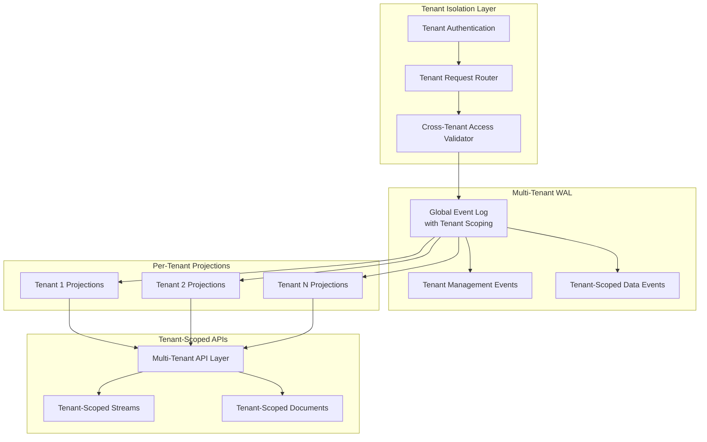

# Design Document

## Overview

ShrikDB Phase 3A introduces true multi-tenancy and namespace isolation as a production-grade extension to the existing event-sourced architecture. The design maintains the event log as the single source of truth while adding tenant boundaries, namespace isolation, and tenant-scoped operations. All tenant state is event-sourced and rebuildable from the WAL, ensuring consistency with the existing architectural principles.

The multi-tenant design follows a "shared infrastructure, isolated data" pattern where tenants share the same ShrikDB cluster but have completely isolated resources, quotas, and access boundaries. This approach enables cost-effective resource utilization while maintaining strict security boundaries.

## Architecture

### Multi-Tenant Event Log Architecture

The core architecture extends the existing Phase 1AB event log with tenant awareness while preserving global ordering and deterministic replay:



### Tenant Resource Naming Convention

All resources follow a strict hierarchical naming pattern that ensures global uniqueness and enables efficient tenant-scoped operations:

```
<tenant_id>:<namespace>:<resource_type>:<resource_name>

Examples:
- acme-corp:production:stream:user-events
- startup-xyz:development:consumer-group:analytics-processors
- enterprise-1:staging:document:user-profiles
```

This naming convention enables:
- Efficient prefix-based filtering for tenant-scoped operations
- Clear resource ownership and access control
- Future horizontal partitioning by tenant boundaries
- Simplified backup and migration operations

## Components and Interfaces

### Tenant Management Component

The tenant management system is entirely event-sourced, with all tenant state derivable from the WAL:

**Tenant Event Types:**
```go
type TenantCreatedEvent struct {
    TenantID      string            `json:"tenant_id"`
    CreatedAt     time.Time         `json:"created_at"`
    InitialQuotas map[string]int64  `json:"initial_quotas"`
    Namespaces    []string          `json:"namespaces"`
}

type TenantNamespaceCreatedEvent struct {
    TenantID    string                 `json:"tenant_id"`
    Namespace   string                 `json:"namespace"`
    Config      NamespaceConfig        `json:"config"`
}

type TenantQuotaUpdatedEvent struct {
    TenantID    string    `json:"tenant_id"`
    QuotaType   string    `json:"quota_type"`
    OldValue    int64     `json:"old_value"`
    NewValue    int64     `json:"new_value"`
    UpdatedAt   time.Time `json:"updated_at"`
}

type TenantDisabledEvent struct {
    TenantID    string    `json:"tenant_id"`
    Reason      string    `json:"reason"`
    DisabledAt  time.Time `json:"disabled_at"`
}
```

**Tenant State Projection:**
```go
type TenantState struct {
    TenantID     string                 `json:"tenant_id"`
    Status       TenantStatus           `json:"status"`
    Namespaces   map[string]Namespace   `json:"namespaces"`
    Quotas       map[string]int64       `json:"quotas"`
    Usage        map[string]int64       `json:"current_usage"`
    CreatedAt    time.Time              `json:"created_at"`
    LastActivity time.Time              `json:"last_activity"`
}

type Namespace struct {
    Name      string          `json:"name"`
    Config    NamespaceConfig `json:"config"`
    CreatedAt time.Time       `json:"created_at"`
}
```

### Tenant-Scoped Access Control

The access control system enforces tenant boundaries at every API entry point:

**Authentication Flow:**
1. Client provides `client_id` and `client_key` in request headers
2. System validates credentials and extracts associated `tenant_id`
3. All subsequent operations are automatically scoped to the authenticated tenant
4. Cross-tenant access attempts are immediately rejected and logged

**Access Control Interface:**
```go
type TenantAccessController interface {
    ValidateAccess(ctx context.Context, tenantID string, resource ResourceKey) error
    ExtractTenantFromAuth(ctx context.Context, clientID, clientKey string) (string, error)
    LogSecurityViolation(ctx context.Context, violation SecurityViolation)
}

type ResourceKey struct {
    TenantID     string `json:"tenant_id"`
    Namespace    string `json:"namespace"`
    ResourceType string `json:"resource_type"`
    ResourceName string `json:"resource_name"`
}

type SecurityViolation struct {
    ClientID         string    `json:"client_id"`
    AttemptedTenant  string    `json:"attempted_tenant"`
    RequestedResource string   `json:"requested_resource"`
    Timestamp        time.Time `json:"timestamp"`
    RequestIP        string    `json:"request_ip"`
}
```

### Multi-Tenant WAL Operations

The WAL is extended to support tenant-scoped operations while maintaining global ordering:

**Enhanced WAL Interface:**
```go
type MultiTenantWAL interface {
    // Existing WAL operations with tenant context
    AppendEvent(ctx context.Context, event Event) error
    ReadEvents(ctx context.Context, filter EventFilter) ([]Event, error)
    
    // New tenant-scoped operations
    ReadTenantEvents(ctx context.Context, tenantID string, filter EventFilter) ([]Event, error)
    GetTenantSequenceNumber(ctx context.Context, tenantID string) (int64, error)
    ReplayTenant(ctx context.Context, tenantID string, handler EventHandler) error
    
    // Tenant management operations
    CreateTenant(ctx context.Context, tenantID string, config TenantConfig) error
    GetTenantState(ctx context.Context, tenantID string) (*TenantState, error)
    ListTenants(ctx context.Context) ([]string, error)
}

type EventFilter struct {
    TenantID     *string   `json:"tenant_id,omitempty"`
    EventTypes   []string  `json:"event_types,omitempty"`
    StartSeq     *int64    `json:"start_sequence,omitempty"`
    EndSeq       *int64    `json:"end_sequence,omitempty"`
    StartTime    *time.Time `json:"start_time,omitempty"`
    EndTime      *time.Time `json:"end_time,omitempty"`
}
```

### Tenant-Aware Replay Engine

The replay engine supports both global and tenant-scoped replay operations:

**Replay Engine Interface:**
```go
type MultiTenantReplayEngine interface {
    // Global replay (all tenants)
    ReplayAll(ctx context.Context, handler EventHandler) error
    
    // Tenant-scoped replay
    ReplayTenant(ctx context.Context, tenantID string, handler EventHandler) error
    
    // Namespace-scoped replay
    ReplayNamespace(ctx context.Context, tenantID, namespace string, handler EventHandler) error
    
    // Progress tracking
    GetReplayProgress(ctx context.Context, replayID string) (*ReplayProgress, error)
    
    // Parallel tenant replay
    ReplayTenantsParallel(ctx context.Context, tenantIDs []string, handler EventHandler) error
}

type ReplayProgress struct {
    ReplayID        string    `json:"replay_id"`
    TenantID        string    `json:"tenant_id"`
    EventsProcessed int64     `json:"events_processed"`
    TotalEvents     int64     `json:"total_events"`
    StartTime       time.Time `json:"start_time"`
    EstimatedEnd    time.Time `json:"estimated_end"`
    Status          string    `json:"status"`
}
```

### Tenant-Scoped Streams Integration

Phase 2AB streams are extended with tenant scoping while maintaining existing semantics:

**Multi-Tenant Streams Interface:**
```go
type MultiTenantStreamsAPI interface {
    // Tenant-scoped stream operations
    CreateStream(ctx context.Context, tenantID, namespace, streamName string, config StreamConfig) error
    PublishMessage(ctx context.Context, tenantID, namespace, streamName string, message Message) error
    
    // Tenant-scoped consumer operations
    CreateConsumerGroup(ctx context.Context, tenantID, namespace, groupName string, config ConsumerConfig) error
    Subscribe(ctx context.Context, tenantID, namespace, groupName string, handler MessageHandler) error
    
    // Tenant-scoped offset management
    CommitOffset(ctx context.Context, tenantID, namespace, groupName, streamName string, offset int64) error
    GetOffset(ctx context.Context, tenantID, namespace, groupName, streamName string) (int64, error)
    
    // Tenant resource listing
    ListStreams(ctx context.Context, tenantID, namespace string) ([]StreamInfo, error)
    ListConsumerGroups(ctx context.Context, tenantID, namespace string) ([]ConsumerGroupInfo, error)
}
```

### Quota Management System

The quota system enforces resource limits per tenant with real-time monitoring:

**Quota Management Interface:**
```go
type QuotaManager interface {
    // Quota enforcement
    CheckQuota(ctx context.Context, tenantID, quotaType string, requestedAmount int64) error
    ConsumeQuota(ctx context.Context, tenantID, quotaType string, amount int64) error
    ReleaseQuota(ctx context.Context, tenantID, quotaType string, amount int64) error
    
    // Quota configuration
    SetQuota(ctx context.Context, tenantID, quotaType string, limit int64) error
    GetQuota(ctx context.Context, tenantID, quotaType string) (*QuotaInfo, error)
    
    // Usage monitoring
    GetUsage(ctx context.Context, tenantID string) (map[string]int64, error)
    GetUsageHistory(ctx context.Context, tenantID string, timeRange TimeRange) ([]UsageSnapshot, error)
}

type QuotaInfo struct {
    TenantID      string    `json:"tenant_id"`
    QuotaType     string    `json:"quota_type"`
    Limit         int64     `json:"limit"`
    CurrentUsage  int64     `json:"current_usage"`
    ResetInterval string    `json:"reset_interval"`
    LastReset     time.Time `json:"last_reset"`
}

// Standard quota types
const (
    QuotaEventsPerSecond    = "events_per_second"
    QuotaMaxStreams         = "max_streams"
    QuotaMaxConsumerGroups  = "max_consumer_groups"
    QuotaStorageBytes       = "storage_bytes"
    QuotaAPIRequestsPerMin  = "api_requests_per_minute"
)
```

## Data Models

### Enhanced Event Structure

Events are extended to include tenant information while maintaining backward compatibility:

```go
type Event struct {
    // Existing fields from Phase 1AB
    EventID       string                 `json:"event_id"`
    ProjectID     string                 `json:"project_id"` // Legacy field for backward compatibility
    EventType     string                 `json:"event_type"`
    Payload       map[string]interface{} `json:"payload"`
    SequenceNum   int64                  `json:"sequence_number"`
    Timestamp     time.Time              `json:"timestamp"`
    Hash          string                 `json:"hash"`
    PreviousHash  string                 `json:"previous_hash"`
    
    // New tenant fields
    TenantID      string                 `json:"tenant_id"`
    Namespace     string                 `json:"namespace"`
    TenantSeqNum  int64                  `json:"tenant_sequence_number"`
    
    // Metadata
    CorrelationID string                 `json:"correlation_id"`
    ClientID      string                 `json:"client_id"`
    RequestIP     string                 `json:"request_ip,omitempty"`
}
```

### Tenant Configuration Model

```go
type TenantConfig struct {
    TenantID      string                 `json:"tenant_id"`
    DisplayName   string                 `json:"display_name"`
    Status        TenantStatus           `json:"status"`
    Quotas        map[string]int64       `json:"quotas"`
    Namespaces    []NamespaceConfig      `json:"namespaces"`
    CreatedAt     time.Time              `json:"created_at"`
    UpdatedAt     time.Time              `json:"updated_at"`
    
    // Operational settings
    RetentionDays int                    `json:"retention_days"`
    BackupEnabled bool                   `json:"backup_enabled"`
    
    // Security settings
    AllowedIPs    []string               `json:"allowed_ips,omitempty"`
    RequireTLS    bool                   `json:"require_tls"`
}

type NamespaceConfig struct {
    Name          string            `json:"name"`
    Description   string            `json:"description"`
    Quotas        map[string]int64  `json:"quotas,omitempty"`
    CreatedAt     time.Time         `json:"created_at"`
}

type TenantStatus string

const (
    TenantStatusActive    TenantStatus = "active"
    TenantStatusSuspended TenantStatus = "suspended"
    TenantStatusDisabled  TenantStatus = "disabled"
)
```

### Metrics and Observability Models

```go
type TenantMetrics struct {
    TenantID           string            `json:"tenant_id"`
    Timestamp          time.Time         `json:"timestamp"`
    EventsPerSecond    float64           `json:"events_per_second"`
    StreamCount        int64             `json:"stream_count"`
    ConsumerGroupCount int64             `json:"consumer_group_count"`
    StorageBytes       int64             `json:"storage_bytes"`
    QuotaUsage         map[string]float64 `json:"quota_usage"`
    APIRequestCount    int64             `json:"api_request_count"`
    ErrorCount         int64             `json:"error_count"`
}

type SecurityEvent struct {
    EventID           string    `json:"event_id"`
    TenantID          string    `json:"tenant_id"`
    EventType         string    `json:"event_type"`
    ClientID          string    `json:"client_id"`
    RequestIP         string    `json:"request_ip"`
    AttemptedResource string    `json:"attempted_resource"`
    Timestamp         time.Time `json:"timestamp"`
    Severity          string    `json:"severity"`
    Details           string    `json:"details"`
}
```

Now I need to use the prework tool to analyze the acceptance criteria before writing the correctness properties:

## Correctness Properties

*A property is a characteristic or behavior that should hold true across all valid executions of a system-essentially, a formal statement about what the system should do. Properties serve as the bridge between human-readable specifications and machine-verifiable correctness guarantees.*

### Property 1: Tenant Event Sourcing Completeness
*For any* tenant lifecycle operation (create, namespace creation, quota update, disable), the system should append the corresponding event to the WAL with all required fields (tenant_id, timestamp, and operation-specific data).
**Validates: Requirements 1.1, 1.2, 1.3, 1.4**

### Property 2: Tenant State Replay Determinism
*For any* sequence of tenant events, replaying them multiple times should produce identical tenant state regardless of the number of replays.
**Validates: Requirements 1.5**

### Property 3: Resource Naming Convention Enforcement
*For any* resource created in the system, its identifier should follow the pattern `<tenant_id>:<namespace>:<resource_type>:<resource_name>` to ensure global uniqueness and tenant isolation.
**Validates: Requirements 2.1, 8.1**

### Property 4: Cross-Tenant Access Rejection
*For any* attempt to access resources belonging to a different tenant, the system should immediately reject the request and log a SECURITY_VIOLATION event with client_id, attempted_tenant, and requested_resource.
**Validates: Requirements 2.2, 10.1**

### Property 5: Tenant-Scoped Resource Access
*For any* authenticated client, all resource access operations (streams, consumer groups, offsets) should be automatically scoped to the client's tenant and namespace, preventing access to other tenants' resources.
**Validates: Requirements 2.3, 2.4, 2.5, 3.2, 3.3, 3.4, 8.2, 8.5**

### Property 6: Authentication Tenant Validation
*For any* client authentication attempt, the system should validate the client_key against the specific tenant_id and extract the correct tenant context for all subsequent operations.
**Validates: Requirements 3.1**

### Property 7: Tenant-Scoped Replay Isolation
*For any* tenant-scoped replay operation, the system should process only events with matching tenant_id and rebuild only that tenant's projections without affecting other tenants.
**Validates: Requirements 3.5, 4.1, 4.3**

### Property 8: Global Replay Tenant Isolation
*For any* global replay operation, the system should process all tenant events while maintaining strict isolation in projections, ensuring no cross-tenant state contamination.
**Validates: Requirements 4.2**

### Property 9: Replay Progress Tenant Scoping
*For any* replay operation, progress metrics should be properly scoped to the target tenant(s) and include accurate counts of events processed and completion estimates.
**Validates: Requirements 4.4**

### Property 10: Replay Error Isolation
*For any* replay operation that encounters invalid tenant events, the system should log the error and continue processing other tenants without failing the entire replay.
**Validates: Requirements 4.5**

### Property 11: Quota Enforcement
*For any* resource creation or usage operation, the system should check tenant quota limits and reject operations that would exceed max_events_per_second, max_streams, or max_consumer_groups quotas.
**Validates: Requirements 5.1, 5.2, 5.3**

### Property 12: Quota Violation Event Logging
*For any* quota violation, the system should append a TENANT_QUOTA_VIOLATION event with tenant_id, quota_type, and attempted_value to provide audit trail.
**Validates: Requirements 5.4, 10.4**

### Property 13: Quota Counter Management
*For any* quota enforcement, the system should maintain accurate per-tenant counters that reset based on configured time windows.
**Validates: Requirements 5.5**

### Property 14: Tenant-Scoped Metrics Collection
*For any* system operation, metrics should be tagged with tenant_id and include per-tenant measurements for events_per_second, stream_count, consumer_group_count, and quota_usage.
**Validates: Requirements 6.1, 6.2, 6.3, 6.4**

### Property 15: Structured Logging Completeness
*For any* system operation, log entries should include tenant_id, namespace, and correlation_id in structured format to enable proper observability and debugging.
**Validates: Requirements 6.5, 10.2, 10.3**

### Property 16: Dual Sequence Number Management
*For any* event appended to the WAL, the system should maintain both global sequence numbers and per-tenant sequence numbers correctly.
**Validates: Requirements 7.1**

### Property 17: Tenant-Filtered WAL Reading
*For any* WAL read operation with tenant filtering, the system should return only events matching the tenant_id while preserving global ordering guarantees.
**Validates: Requirements 7.2**

### Property 18: Dual Hash Chain Integrity
*For any* WAL integrity verification, the system should validate both global and per-tenant hash chains to ensure data consistency.
**Validates: Requirements 7.3**

### Property 19: Tenant-Specific Backup Operations
*For any* tenant backup operation, the resulting backup should contain only data belonging to the specified tenant and be portable for migration.
**Validates: Requirements 7.4**

### Property 20: Corruption Isolation
*For any* WAL corruption detection, the system should isolate the corruption to specific tenants when possible, preventing system-wide impact.
**Validates: Requirements 7.5**

### Property 21: Consumer Group Tenant Scoping
*For any* consumer group operations, group names should be unique only within tenant scope, allowing different tenants to use the same group names without conflict.
**Validates: Requirements 8.3**

### Property 22: Offset Storage Qualification
*For any* offset commit operation, offsets should be stored with full tenant and namespace qualification following the pattern `<tenant_id>:<namespace>:<consumer_group>:<stream>`.
**Validates: Requirements 8.4**

### Property 23: Configuration Event Sourcing
*For any* tenant configuration update, the system should append TENANT_CONFIG_UPDATED events with tenant_id and configuration changes to maintain audit trail.
**Validates: Requirements 11.1**

### Property 24: Namespace-Specific Configuration
*For any* namespace configuration, the system should support namespace-specific quotas and access policies that are properly isolated from other namespaces.
**Validates: Requirements 11.2**

### Property 25: Configuration Query Isolation
*For any* tenant configuration query, the system should return only configuration accessible to the authenticated tenant.
**Validates: Requirements 11.3**

### Property 26: Configuration Validation
*For any* configuration change, the system should validate the changes against system-wide constraints before applying them.
**Validates: Requirements 11.4**

### Property 27: Configuration Replay Determinism
*For any* tenant configuration replay, the system should rebuild tenant settings deterministically from configuration events.
**Validates: Requirements 11.5**

### Property 28: Backward Compatibility Preservation
*For any* existing single-tenant operation, the system should continue to function correctly after Phase 3A deployment with automatic default tenant scoping.
**Validates: Requirements 12.1, 12.2**

### Property 29: Stream Semantics Preservation
*For any* Phase 2AB stream operation, the core stream semantics should remain unchanged while adding tenant scoping functionality.
**Validates: Requirements 12.3**

### Property 30: Event Structure Compatibility
*For any* Phase 1AB event processing, the system should add tenant information without breaking existing event structure compatibility.
**Validates: Requirements 12.4**

### Property 31: Tenant Management API Availability
*For any* tenant onboarding operation, the system should provide functional APIs for tenant creation, quota assignment, and namespace setup.
**Validates: Requirements 13.2**

### Property 32: Tenant-Specific Maintenance Operations
*For any* system maintenance operation, the system should support tenant-specific backup, restore, and migration operations.
**Validates: Requirements 13.3**

### Property 33: Tenant-Scoped Monitoring
*For any* monitoring configuration, the system should expose tenant-specific health checks and performance metrics.
**Validates: Requirements 13.4**

### Property 34: Tenant-Scoped Debugging Tools
*For any* incident response, the system should provide tenant-scoped debugging and recovery tools.
**Validates: Requirements 13.5**

## Error Handling

### Tenant Isolation Error Handling

The system implements comprehensive error handling that maintains tenant isolation even during failure scenarios:

**Cross-Tenant Access Errors:**
- Immediate request rejection with HTTP 403 Forbidden
- Security violation event logging with full context
- Rate limiting for repeated violation attempts
- Automatic client blocking for persistent violations

**Quota Violation Handling:**
- Graceful degradation with HTTP 429 Too Many Requests
- Detailed quota violation event logging
- Client notification with retry-after headers
- Automatic quota reset based on time windows

**Tenant State Corruption:**
- Isolated tenant replay without affecting other tenants
- Corruption event logging with tenant scope
- Automatic fallback to last known good state
- Administrative alerts for manual intervention

**Authentication Failures:**
- Secure error messages that don't leak tenant information
- Failed authentication event logging
- Progressive backoff for repeated failures
- Account lockout protection

### Replay Error Handling

**Tenant Replay Failures:**
- Continue processing other tenants on individual tenant failures
- Detailed error logging with tenant context
- Partial replay completion tracking
- Retry mechanisms for transient failures

**Event Corruption During Replay:**
- Skip corrupted events with detailed logging
- Continue replay from next valid event
- Maintain replay progress tracking
- Generate corruption reports for investigation

## Testing Strategy

### Dual Testing Approach

The multi-tenant system requires both unit testing and property-based testing to ensure comprehensive coverage:

**Unit Tests:**
- Specific tenant isolation scenarios
- Edge cases in quota enforcement
- Authentication failure handling
- Configuration validation edge cases
- Cross-tenant access attempt scenarios

**Property-Based Tests:**
- Universal tenant isolation properties across all inputs
- Quota enforcement across random usage patterns
- Event sourcing round-trip properties for tenant operations
- Replay determinism across random event sequences
- Resource naming convention enforcement across all resource types

### Property-Based Testing Configuration

**Testing Framework:** Go's `testing/quick` package with custom generators
**Minimum Iterations:** 100 per property test
**Test Tagging Format:** `Feature: shrikdb-phase-3a, Property {number}: {property_text}`

**Custom Generators:**
- Tenant ID generator (valid format constraints)
- Namespace generator (valid naming patterns)
- Resource name generator (various types and patterns)
- Event sequence generator (realistic tenant operations)
- Quota usage pattern generator (various load scenarios)

### Integration Testing Strategy

**Multi-Tenant Integration Tests:**
- End-to-end tenant isolation verification
- Cross-phase integration with Phase 1AB and Phase 2AB
- Performance testing under multi-tenant load
- Failure scenario testing with tenant isolation
- Security penetration testing for tenant boundaries

**Verification Scripts:**
- Automated tenant creation and isolation verification
- Cross-tenant access attempt validation
- Quota enforcement verification across multiple tenants
- Replay isolation verification
- Metrics and logging verification

The testing strategy ensures that multi-tenancy is not just functionally correct but also maintains the production-grade reliability and security required for the ShrikDB system.