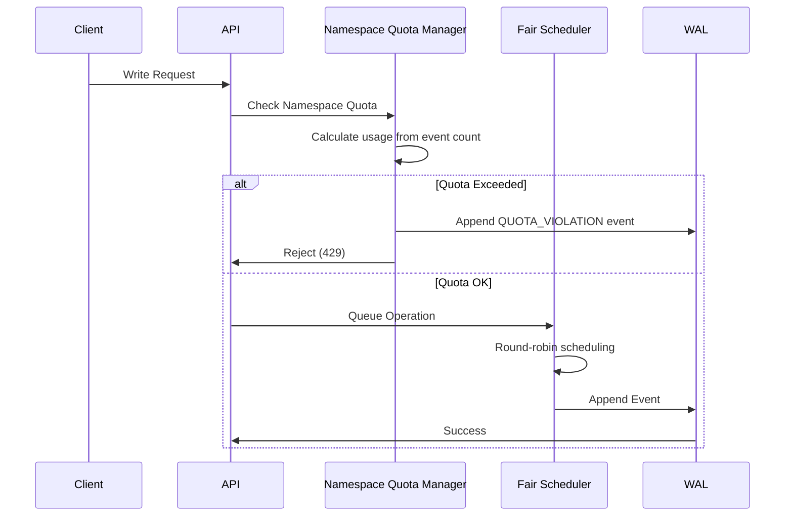

# Design Document

## Overview

ShrikDB Phase 3B implements Scale & Isolation Hardening as a direct extension of Phase 3A multi-tenancy. The design ensures the system remains safe under load by preventing noisy-neighbor effects through namespace-level quotas, fair scheduling, and backpressure mechanisms. All decisions are event-derived to maintain deterministic replay, preparing the system for horizontal scaling in Phase 4.

The core principle is that one namespace cannot starve another, and the system remains deterministic regardless of load patterns. This is achieved through:
- Namespace-level quota enforcement with event-sourced state
- Fair scheduling using round-robin with starvation prevention
- Backpressure that isolates overloaded namespaces without affecting others
- Metrics derived entirely from events for replay safety

## Architecture

### Scale & Isolation Architecture

The architecture extends Phase 3A's tenant isolation with namespace-level resource management:

```mermaid
graph TB
    subgraph "Namespace Quota Layer"
        NQ[Namespace Quota Manager]
        NQ --> RateLimiter[Rate Limiter]
        NQ --> CapEnforcer[Cap Enforcer]
        NQ --> QuotaEvents[Quota Violation Events]
    end

    subgraph "Fair Scheduler"
        FS[Fair Scheduler]
        FS --> RoundRobin[Round-Robin Queue]
        FS --> StarvationDetector[Starvation Detector]
        FS --> PriorityBoost[Priority Boost]
    end
    
    subgraph "Backpressure System"
        BP[Backpressure Controller]
        BP --> QueueMonitor[Queue Depth Monitor]
        BP --> ThrottleController[Throttle Controller]
        BP --> BackpressureEvents[Backpressure Events]
    end
    
    subgraph "Metrics Collector"
        MC[Replay-Safe Metrics]
        MC --> ThrottleMetrics[Throttled Events]
        MC --> RejectMetrics[Rejected Writes]
        MC --> QueueMetrics[Queue Depth]
        MC --> LatencyMetrics[Latency per Namespace]
    end
    
    subgraph "Phase 3A Foundation"
        TM[Tenant Manager]
        WAL[Multi-Tenant WAL]
        QM[Quota Manager]
    end
    
    NQ --> TM
    NQ --> WAL
    FS --> WAL
    BP --> FS
    MC --> WAL
    QM --> NQ
```



### Event-Derived Decision Making

All scheduling and quota decisions are based on event-derived state, not wall-clock time:



## Components and Interfaces

### Namespace Quota Manager

Extends Phase 3A's QuotaManager with namespace-level granularity:

```go
// NamespaceQuotaManager extends quota management to namespace level.
type NamespaceQuotaManager interface {
    // Namespace quota configuration
    SetNamespaceQuota(ctx context.Context, tenantID, namespaceID, quotaType string, limit int64) error
    GetNamespaceQuota(ctx context.Context, tenantID, namespaceID, quotaType string) (*NamespaceQuotaInfo, error)
    
    // Namespace quota enforcement
    CheckNamespaceQuota(ctx context.Context, tenantID, namespaceID, quotaType string, amount int64) error
    ConsumeNamespaceQuota(ctx context.Context, tenantID, namespaceID, quotaType string, amount int64) error
    ReleaseNamespaceQuota(ctx context.Context, tenantID, namespaceID, quotaType string, amount int64) error
    
    // Rate limiting (event-window based)
    CheckRateLimit(ctx context.Context, tenantID, namespaceID string) error
    GetRateLimitState(ctx context.Context, tenantID, namespaceID string) (*RateLimitState, error)
    
    // Cap enforcement
    CheckStreamCap(ctx context.Context, tenantID, namespaceID string) error
    CheckConsumerGroupCap(ctx context.Context, tenantID, namespaceID string) error
    IncrementStreamCount(ctx context.Context, tenantID, namespaceID string) error
    DecrementStreamCount(ctx context.Context, tenantID, namespaceID string) error
}

// NamespaceQuotaInfo provides namespace-level quota information.
type NamespaceQuotaInfo struct {
    TenantID      string    `json:"tenant_id"`
    NamespaceID   string    `json:"namespace_id"`
    QuotaType     string    `json:"quota_type"`
    Limit         int64     `json:"limit"`
    CurrentUsage  int64     `json:"current_usage"`
    InheritedFrom string    `json:"inherited_from"` // "namespace" or "tenant"
    LastUpdated   int64     `json:"last_updated_seq"` // Event sequence, not timestamp
}

// RateLimitState tracks rate limit using event windows.
type RateLimitState struct {
    TenantID          string `json:"tenant_id"`
    NamespaceID       string `json:"namespace_id"`
    WindowStartSeq    int64  `json:"window_start_seq"`
    EventsInWindow    int64  `json:"events_in_window"`
    WindowSize        int64  `json:"window_size"` // Number of events per window
    Limit             int64  `json:"limit"`
    IsLimited         bool   `json:"is_limited"`
}
```

### Fair Scheduler

Implements round-robin scheduling with starvation prevention:

```go
// FairScheduler ensures equitable resource distribution across namespaces.
type FairScheduler interface {
    // Queue management
    EnqueueOperation(ctx context.Context, op NamespaceOperation) error
    DequeueNext(ctx context.Context) (*NamespaceOperation, error)
    
    // Scheduling state
    GetSchedulingState(ctx context.Context, tenantID, namespaceID string) (*SchedulingState, error)
    GetAllSchedulingStates(ctx context.Context) ([]SchedulingState, error)
    
    // Starvation detection
    CheckStarvation(ctx context.Context, tenantID, namespaceID string) (*StarvationInfo, error)
    BoostPriority(ctx context.Context, tenantID, namespaceID string) error
    
    // Throughput guarantees
    SetMinimumThroughput(ctx context.Context, tenantID, namespaceID string, minOps int64) error
    GetThroughputState(ctx context.Context, tenantID, namespaceID string) (*ThroughputState, error)
}

// NamespaceOperation represents a queued operation for a namespace.
type NamespaceOperation struct {
    TenantID      string                 `json:"tenant_id"`
    NamespaceID   string                 `json:"namespace_id"`
    OperationType string                 `json:"operation_type"`
    Payload       map[string]interface{} `json:"payload"`
    EnqueuedSeq   int64                  `json:"enqueued_seq"` // Global sequence when enqueued
    Priority      int                    `json:"priority"`
}

// SchedulingState tracks scheduling metrics per namespace.
type SchedulingState struct {
    TenantID           string `json:"tenant_id"`
    NamespaceID        string `json:"namespace_id"`
    OperationsProcessed int64 `json:"operations_processed"`
    LastProcessedSeq   int64  `json:"last_processed_seq"`
    SchedulingWeight   int    `json:"scheduling_weight"`
    QueueDepth         int64  `json:"queue_depth"`
    IsBoosted          bool   `json:"is_boosted"`
}

// StarvationInfo provides starvation detection data.
type StarvationInfo struct {
    TenantID            string `json:"tenant_id"`
    NamespaceID         string `json:"namespace_id"`
    LastProcessedSeq    int64  `json:"last_processed_seq"`
    EventsSinceProcess  int64  `json:"events_since_process"`
    IsStarved           bool   `json:"is_starved"`
    StarvationThreshold int64  `json:"starvation_threshold"`
}

// ThroughputState tracks throughput guarantees.
type ThroughputState struct {
    TenantID           string `json:"tenant_id"`
    NamespaceID        string `json:"namespace_id"`
    GuaranteedMinimum  int64  `json:"guaranteed_minimum"`
    ActualThroughput   int64  `json:"actual_throughput"` // Ops per event window
    GuaranteeMet       bool   `json:"guarantee_met"`
    WindowStartSeq     int64  `json:"window_start_seq"`
}
```

### Backpressure Controller

Applies backpressure to overloaded namespaces without affecting others:

```go
// BackpressureController manages backpressure for overloaded namespaces.
type BackpressureController interface {
    // Backpressure management
    CheckBackpressure(ctx context.Context, tenantID, namespaceID string) (*BackpressureState, error)
    ApplyBackpressure(ctx context.Context, tenantID, namespaceID string, reason string) error
    ReleaseBackpressure(ctx context.Context, tenantID, namespaceID string) error
    
    // Queue depth monitoring
    GetQueueDepth(ctx context.Context, tenantID, namespaceID string) (int64, error)
    SetQueueDepthThreshold(ctx context.Context, tenantID, namespaceID string, threshold int64) error
    
    // Backpressure state
    GetAllBackpressuredNamespaces(ctx context.Context) ([]BackpressureState, error)
}

// BackpressureState tracks backpressure for a namespace.
type BackpressureState struct {
    TenantID         string `json:"tenant_id"`
    NamespaceID      string `json:"namespace_id"`
    IsBackpressured  bool   `json:"is_backpressured"`
    QueueDepth       int64  `json:"queue_depth"`
    Threshold        int64  `json:"threshold"`
    BackpressureSeq  int64  `json:"backpressure_seq"` // Sequence when backpressure was applied
    Reason           string `json:"reason"`
}
```

### Replay-Safe Metrics Collector

Collects metrics derived entirely from events:

```go
// ReplaySafeMetrics collects metrics that can be deterministically rebuilt from events.
type ReplaySafeMetrics interface {
    // Throttle metrics
    RecordThrottle(ctx context.Context, tenantID, namespaceID, reason string, seq int64) error
    GetThrottleMetrics(ctx context.Context, tenantID, namespaceID string) (*ThrottleMetrics, error)
    
    // Rejection metrics
    RecordRejection(ctx context.Context, tenantID, namespaceID, rejectionType string, seq int64) error
    GetRejectionMetrics(ctx context.Context, tenantID, namespaceID string) (*RejectionMetrics, error)
    
    // Queue depth metrics
    RecordQueueDepth(ctx context.Context, tenantID, namespaceID string, depth int64, seq int64) error
    GetQueueDepthMetrics(ctx context.Context, tenantID, namespaceID string) (*QueueDepthMetrics, error)
    
    // Latency metrics (event-sequence based)
    RecordLatency(ctx context.Context, tenantID, namespaceID string, startSeq, endSeq int64) error
    GetLatencyMetrics(ctx context.Context, tenantID, namespaceID string) (*LatencyMetrics, error)
    
    // Rebuild from events
    RebuildFromEvents(ctx context.Context, events []Event) error
    GetMetricsSnapshot(ctx context.Context) (*MetricsSnapshot, error)
}

// ThrottleMetrics tracks throttling per namespace.
type ThrottleMetrics struct {
    TenantID         string            `json:"tenant_id"`
    NamespaceID      string            `json:"namespace_id"`
    ThrottledCount   int64             `json:"throttled_count"`
    ThrottlesByReason map[string]int64 `json:"throttles_by_reason"`
    LastThrottleSeq  int64             `json:"last_throttle_seq"`
}

// RejectionMetrics tracks rejections per namespace.
type RejectionMetrics struct {
    TenantID          string            `json:"tenant_id"`
    NamespaceID       string            `json:"namespace_id"`
    RejectedCount     int64             `json:"rejected_count"`
    RejectionsByType  map[string]int64  `json:"rejections_by_type"` // quota, rate_limit, cap, backpressure
    LastRejectionSeq  int64             `json:"last_rejection_seq"`
}

// QueueDepthMetrics tracks queue depth per namespace.
type QueueDepthMetrics struct {
    TenantID      string `json:"tenant_id"`
    NamespaceID   string `json:"namespace_id"`
    CurrentDepth  int64  `json:"current_depth"`
    MaxDepth      int64  `json:"max_depth"`
    AvgDepth      int64  `json:"avg_depth"`
    SampleCount   int64  `json:"sample_count"`
}

// LatencyMetrics tracks latency using event sequence differences.
type LatencyMetrics struct {
    TenantID      string `json:"tenant_id"`
    NamespaceID   string `json:"namespace_id"`
    P50SeqDiff    int64  `json:"p50_seq_diff"` // Sequence difference, not time
    P95SeqDiff    int64  `json:"p95_seq_diff"`
    P99SeqDiff    int64  `json:"p99_seq_diff"`
    MaxSeqDiff    int64  `json:"max_seq_diff"`
    SampleCount   int64  `json:"sample_count"`
}

// MetricsSnapshot represents all metrics at a point in time.
type MetricsSnapshot struct {
    GlobalSeq        int64                        `json:"global_seq"`
    ThrottleMetrics  map[string]*ThrottleMetrics  `json:"throttle_metrics"`  // key: tenant:namespace
    RejectionMetrics map[string]*RejectionMetrics `json:"rejection_metrics"`
    QueueMetrics     map[string]*QueueDepthMetrics `json:"queue_metrics"`
    LatencyMetrics   map[string]*LatencyMetrics   `json:"latency_metrics"`
}
```

## Data Models

### Namespace Quota Events

Events for namespace-level quota management:

```go
// Event types for Phase 3B
const (
    EventTypeNamespaceQuotaSet       = "NAMESPACE_QUOTA_SET"
    EventTypeNamespaceQuotaUpdated   = "NAMESPACE_QUOTA_UPDATED"
    EventTypeNamespaceRateLimitExceeded = "NAMESPACE_RATE_LIMIT_EXCEEDED"
    EventTypeNamespaceCapExceeded    = "NAMESPACE_CAP_EXCEEDED"
    EventTypeQuotaViolation          = "QUOTA_VIOLATION"
    EventTypeNamespaceAbuseDetected  = "NAMESPACE_ABUSE_DETECTED"
    EventTypeNamespaceBackpressureApplied = "NAMESPACE_BACKPRESSURE_APPLIED"
    EventTypeNamespaceBackpressureReleased = "NAMESPACE_BACKPRESSURE_RELEASED"
    EventTypeThroughputGuaranteeViolated = "THROUGHPUT_GUARANTEE_VIOLATED"
    EventTypeNamespaceStarvationDetected = "NAMESPACE_STARVATION_DETECTED"
    EventTypeNamespaceQueueDepthHigh = "NAMESPACE_QUEUE_DEPTH_HIGH"
    EventTypeNamespaceLatencyHigh    = "NAMESPACE_LATENCY_HIGH"
)

// NamespaceQuotaSetEvent represents setting a namespace quota.
type NamespaceQuotaSetEvent struct {
    TenantID    string `json:"tenant_id"`
    NamespaceID string `json:"namespace_id"`
    QuotaType   string `json:"quota_type"`
    LimitValue  int64  `json:"limit_value"`
    SetBySeq    int64  `json:"set_by_seq"` // Global sequence when set
}

// NamespaceQuotaUpdatedEvent represents updating a namespace quota.
type NamespaceQuotaUpdatedEvent struct {
    TenantID    string `json:"tenant_id"`
    NamespaceID string `json:"namespace_id"`
    QuotaType   string `json:"quota_type"`
    OldValue    int64  `json:"old_value"`
    NewValue    int64  `json:"new_value"`
    UpdatedSeq  int64  `json:"updated_seq"`
}

// NamespaceRateLimitExceededEvent represents a rate limit violation.
type NamespaceRateLimitExceededEvent struct {
    TenantID       string `json:"tenant_id"`
    NamespaceID    string `json:"namespace_id"`
    EventsInWindow int64  `json:"events_in_window"`
    Limit          int64  `json:"limit"`
    WindowStartSeq int64  `json:"window_start_seq"`
    CorrelationID  string `json:"correlation_id"`
}

// NamespaceCapExceededEvent represents a cap violation.
type NamespaceCapExceededEvent struct {
    TenantID      string `json:"tenant_id"`
    NamespaceID   string `json:"namespace_id"`
    CapType       string `json:"cap_type"` // "streams" or "consumer_groups"
    CurrentCount  int64  `json:"current_count"`
    MaxCap        int64  `json:"max_cap"`
    CorrelationID string `json:"correlation_id"`
}

// QuotaViolationEvent represents any quota violation.
type QuotaViolationEvent struct {
    TenantID       string `json:"tenant_id"`
    NamespaceID    string `json:"namespace_id"`
    QuotaType      string `json:"quota_type"`
    AttemptedValue int64  `json:"attempted_value"`
    CurrentUsage   int64  `json:"current_usage"`
    Limit          int64  `json:"limit"`
    CorrelationID  string `json:"correlation_id"`
}

// NamespaceBackpressureAppliedEvent represents backpressure being applied.
type NamespaceBackpressureAppliedEvent struct {
    TenantID    string `json:"tenant_id"`
    NamespaceID string `json:"namespace_id"`
    QueueDepth  int64  `json:"queue_depth"`
    Threshold   int64  `json:"threshold"`
    Reason      string `json:"reason"`
}

// NamespaceBackpressureReleasedEvent represents backpressure being released.
type NamespaceBackpressureReleasedEvent struct {
    TenantID    string `json:"tenant_id"`
    NamespaceID string `json:"namespace_id"`
    QueueDepth  int64  `json:"queue_depth"`
    Duration    int64  `json:"duration_events"` // Duration in events, not time
}

// ThroughputGuaranteeViolatedEvent represents a throughput guarantee violation.
type ThroughputGuaranteeViolatedEvent struct {
    TenantID          string `json:"tenant_id"`
    NamespaceID       string `json:"namespace_id"`
    GuaranteedMinimum int64  `json:"guaranteed_minimum"`
    ActualThroughput  int64  `json:"actual_throughput"`
    WindowStartSeq    int64  `json:"window_start_seq"`
    WindowEndSeq      int64  `json:"window_end_seq"`
}

// NamespaceStarvationDetectedEvent represents starvation detection.
type NamespaceStarvationDetectedEvent struct {
    TenantID           string `json:"tenant_id"`
    NamespaceID        string `json:"namespace_id"`
    LastProcessedSeq   int64  `json:"last_processed_seq"`
    IdleDurationEvents int64  `json:"idle_duration_events"`
}
```

### Namespace State Model

Extended namespace state for Phase 3B:

```go
// NamespaceState extends Phase 3A namespace with quota and scheduling state.
type NamespaceState struct {
    // Identity
    TenantID    string `json:"tenant_id"`
    NamespaceID string `json:"namespace_id"`
    
    // Quotas (namespace-level, inherits from tenant if not set)
    Quotas map[string]int64 `json:"quotas"`
    Usage  map[string]int64 `json:"usage"`
    
    // Rate limiting (event-window based)
    RateLimitWindowStart int64 `json:"rate_limit_window_start"`
    RateLimitEventCount  int64 `json:"rate_limit_event_count"`
    RateLimitMax         int64 `json:"rate_limit_max"`
    
    // Caps
    StreamCount        int64 `json:"stream_count"`
    MaxStreams         int64 `json:"max_streams"`
    ConsumerGroupCount int64 `json:"consumer_group_count"`
    MaxConsumerGroups  int64 `json:"max_consumer_groups"`
    
    // Scheduling
    LastProcessedSeq    int64 `json:"last_processed_seq"`
    OperationsProcessed int64 `json:"operations_processed"`
    SchedulingWeight    int   `json:"scheduling_weight"`
    IsBoosted           bool  `json:"is_boosted"`
    
    // Backpressure
    QueueDepth      int64  `json:"queue_depth"`
    QueueThreshold  int64  `json:"queue_threshold"`
    IsBackpressured bool   `json:"is_backpressured"`
    
    // Throughput guarantee
    MinThroughputGuarantee int64 `json:"min_throughput_guarantee"`
    
    // Metrics (replay-safe)
    ThrottledCount    int64            `json:"throttled_count"`
    RejectedCount     int64            `json:"rejected_count"`
    RejectionsByType  map[string]int64 `json:"rejections_by_type"`
    ViolationCount    int64            `json:"violation_count"`
}

// ApplyEvent applies a Phase 3B event to namespace state.
func (ns *NamespaceState) ApplyEvent(evt *Event) error {
    switch evt.EventType {
    case EventTypeNamespaceQuotaSet:
        return ns.applyQuotaSet(evt)
    case EventTypeNamespaceQuotaUpdated:
        return ns.applyQuotaUpdated(evt)
    case EventTypeNamespaceRateLimitExceeded:
        return ns.applyRateLimitExceeded(evt)
    case EventTypeNamespaceCapExceeded:
        return ns.applyCapExceeded(evt)
    case EventTypeQuotaViolation:
        return ns.applyQuotaViolation(evt)
    case EventTypeNamespaceBackpressureApplied:
        return ns.applyBackpressureApplied(evt)
    case EventTypeNamespaceBackpressureReleased:
        return ns.applyBackpressureReleased(evt)
    case EventTypeNamespaceStarvationDetected:
        return ns.applyStarvationDetected(evt)
    default:
        return nil // Ignore unknown events
    }
}
```


## Correctness Properties

*A property is a characteristic or behavior that should hold true across all valid executions of a system-essentially, a formal statement about what the system should do. Properties serve as the bridge between human-readable specifications and machine-verifiable correctness guarantees.*

### Property 1: Namespace Quota Event Sourcing Round-Trip

*For any* namespace quota configuration (set or update), the system should append the corresponding event with all required fields, and replaying those events should produce identical quota state.

**Validates: Requirements 1.1, 1.2, 1.3, 1.4**

### Property 2: Namespace Quota Inheritance

*For any* namespace without an explicit quota, querying that quota should return the tenant-level default value.

**Validates: Requirements 1.5**

### Property 3: Rate Limit Enforcement Using Event Windows

*For any* namespace with a rate limit, the system should track event counts using event-derived windows (sequence-based, not wall-clock), reject writes that exceed the limit, and append NAMESPACE_RATE_LIMIT_EXCEEDED events.

**Validates: Requirements 2.1, 2.2, 2.3, 2.4, 2.5**

### Property 4: Stream and Consumer Group Cap Enforcement

*For any* namespace with stream/consumer group caps, creating resources up to the cap should succeed, and exceeding the cap should be rejected with a NAMESPACE_CAP_EXCEEDED event. Deleting resources should free capacity.

**Validates: Requirements 3.1, 3.2, 3.3, 3.4, 3.5**

### Property 5: Quota Violation Event Completeness

*For any* quota violation, the system should append a QUOTA_VIOLATION event containing tenant_id, namespace_id, quota_type, attempted_value, current_usage, and correlation_id.

**Validates: Requirements 4.1, 4.2, 4.3, 4.5**

### Property 6: Abuse Detection Threshold

*For any* namespace that accumulates violations exceeding the abuse threshold, the system should emit a NAMESPACE_ABUSE_DETECTED event.

**Validates: Requirements 4.4**

### Property 7: Fair Scheduling Determinism

*For any* set of namespaces with pending operations, the scheduler should process them using round-robin scheduling, and replaying the same event sequence should produce identical scheduling decisions.

**Validates: Requirements 5.1, 5.2, 5.3, 5.4, 5.5**

### Property 8: Backpressure Isolation

*For any* namespace under backpressure (queue depth exceeds threshold), other namespaces should continue processing at normal speed, and backpressure events should be logged.

**Validates: Requirements 6.1, 6.2, 6.3, 6.4, 6.5**

### Property 9: Throughput Guarantee Enforcement

*For any* namespace with a minimum throughput guarantee, the system should ensure the namespace receives at least its guaranteed throughput under load, using event-derived metrics.

**Validates: Requirements 7.1, 7.2, 7.3, 7.4, 7.5**

### Property 10: Concurrent Write Isolation

*For any* concurrent writes from 5+ namespaces, the system should process them without data corruption, maintain correct per-namespace sequence numbers, and ensure no namespace experiences starvation.

**Validates: Requirements 8.1, 8.2, 8.3, 8.4, 8.5**

### Property 11: Sequence Number Integrity Under Load

*For any* sequence of events appended under high load, per-namespace sequence numbers should be monotonically increasing with no gaps or duplicates.

**Validates: Requirements 9.1, 9.2, 9.3, 9.4, 9.5**

### Property 12: Starvation Prevention

*For any* namespace that has not been processed for an extended period (measured in events, not time), the system should detect starvation, boost its priority, and log a NAMESPACE_STARVATION_DETECTED event.

**Validates: Requirements 10.1, 10.2, 10.3, 10.4, 10.5**

### Property 13: Replay-Safe Throttle Metrics

*For any* throttle events, the system should maintain per-namespace throttle counters that can be deterministically rebuilt from events.

**Validates: Requirements 11.1, 11.2, 11.3, 11.4, 11.5**

### Property 14: Replay-Safe Rejection Metrics

*For any* rejection events, the system should maintain per-namespace rejection counters categorized by type that can be deterministically rebuilt from events.

**Validates: Requirements 12.1, 12.2, 12.3, 12.4, 12.5**

### Property 15: Replay-Safe Queue Depth Metrics

*For any* queue operations, the system should track per-namespace queue depth that can be deterministically rebuilt from events.

**Validates: Requirements 13.1, 13.2, 13.3, 13.4, 13.5**

### Property 16: Replay-Safe Latency Metrics

*For any* completed operations, the system should track per-namespace latency using event sequence differences (not wall-clock time) that can be deterministically rebuilt from events.

**Validates: Requirements 14.1, 14.2, 14.3, 14.4, 14.5**

### Property 17: Metrics Replay Determinism

*For any* metrics snapshot taken before a crash, replaying all events should produce a byte-identical metrics snapshot.

**Validates: Requirements 15.1, 15.2, 15.3, 15.4, 15.5**

## Error Handling

### Quota Violation Handling

When quota violations occur, the system:
1. Rejects the operation with a clear error code (429 Too Many Requests)
2. Appends a QUOTA_VIOLATION event with full context
3. Increments violation counters for abuse detection
4. Returns retry guidance based on event window boundaries

### Backpressure Handling

When backpressure is applied:
1. The overloaded namespace's operations are delayed
2. Other namespaces continue at normal speed
3. NAMESPACE_BACKPRESSURE_APPLIED event is logged
4. Queue depth is monitored for release threshold

### Starvation Handling

When starvation is detected:
1. NAMESPACE_STARVATION_DETECTED event is logged
2. Namespace priority is temporarily boosted
3. Scheduler ensures the namespace gets processing time
4. Priority boost is released after processing

### Concurrent Write Conflicts

When concurrent writes occur:
1. Each namespace maintains its own sequence counter
2. Global sequence is assigned atomically
3. Per-namespace ordering is preserved
4. No cross-namespace interference occurs


## Testing Strategy

### Dual Testing Approach

Phase 3B requires both unit testing and property-based testing:

**Unit Tests:**
- Specific quota violation scenarios
- Edge cases in rate limiting (window boundaries)
- Backpressure threshold edge cases
- Starvation detection timing
- Concurrent write ordering

**Property-Based Tests:**
- Universal quota enforcement across random configurations
- Fair scheduling across random namespace loads
- Backpressure isolation across random queue depths
- Sequence integrity across random concurrent writes
- Metrics replay determinism across random event sequences

### Property-Based Testing Configuration

**Testing Framework:** Go's `testing/quick` package with custom generators
**Minimum Iterations:** 100 per property test
**Test Tagging Format:** `Feature: shrikdb-phase-3b, Property {number}: {property_text}`

**Custom Generators:**
- Namespace quota configuration generator
- Rate limit window generator (event-based)
- Concurrent write sequence generator
- Queue depth pattern generator
- Metrics event sequence generator

### Integration Testing Strategy

**Noisy-Neighbor Tests:**
- Flood one namespace while monitoring others
- Verify non-flooded namespaces maintain throughput
- Verify flooded namespace is properly throttled

**Replay Determinism Tests:**
- Generate random event sequences
- Take metrics snapshot
- Replay events
- Verify byte-identical metrics

**Concurrent Write Tests:**
- Spawn 5+ concurrent writers to different namespaces
- Verify per-namespace sequence integrity
- Verify no starvation occurs

### Verification Script Requirements

The `verify-phase3b.js` script must:
1. Create 5+ namespaces across multiple tenants
2. Configure quotas and rate limits per namespace
3. Flood one namespace with excessive writes
4. Verify other namespaces are unaffected
5. Kill the process
6. Replay all events
7. Verify identical quota and isolation state
8. Output machine-verifiable assertions (JSON with pass/fail)
